# Generative Adversarial Network (GAN) Implementation

## Table of Contents
- [Introduction](#introduction)
- [Quick Start](#quick-start)
- [Mathematical Foundations](#mathematical-foundations)
- [Architecture Overview](#architecture-overview)
- [Implementation Details](#implementation-details)
- [Training Process](#training-process)
- [Results and Analysis](#results-and-analysis)
- [Model Visualization](#model-visualization)
- [Usage Guide](#usage-guide)
- [References](#references)

## Introduction

This project implements a **Generative Adversarial Network (GAN)** from scratch using PyTorch. A GAN is a class of generative models that consists of two neural networks competing against each other: a **Generator** that creates synthetic data and a **Discriminator** that tries to distinguish between real and fake data.

### What makes GANs special?

Think of GANs as a sophisticated game between an art forger and an art expert. The forger (Generator) continuously improves their technique to create convincing fakes, while the expert (Discriminator) becomes increasingly skilled at detecting them. This adversarial training process leads to the generation of increasingly realistic synthetic data.

**Analogy**: Imagine a master counterfeiter and a detective in an endless game of cat and mouse. The counterfeiter learns to create more convincing fakes, while the detective develops sharper detection skills. Over time, the counterfeiter becomes so skilled that even the detective can't tell the difference between real and fake.

## Quick Start

1. **Load the notebook**: Open `gan.ipynb` in Jupyter
2. **Run all cells**: The notebook includes comprehensive training and visualization
3. **Monitor training**: Generator and discriminator losses are displayed during training

For complete implementation details, see the sections below.

## Mathematical Foundations

### Core GAN Objective

The GAN optimizes a minimax game between the Generator (G) and Discriminator (D):

```
min_G max_D V(D,G) = E_x~p_data(x)[log D(x)] + E_z~p_z(z)[log(1 - D(G(z)))]
```

Where:
- `p_data(x)`: Real data distribution
- `p_z(z)`: Prior noise distribution (typically N(0,I))
- `G(z)`: Generator function mapping noise to data
- `D(x)`: Discriminator function outputting probability of real data

<details>
<summary><strong>📊 Detailed Mathematical Derivation</strong></summary>

### Loss Function Components

#### 1. Discriminator Loss
```
L_D = -E_x~p_data(x)[log D(x)] - E_z~p_z(z)[log(1 - D(G(z)))]
```
This measures how well the discriminator distinguishes real from fake data.

**In the code**: Binary Cross-Entropy Loss
```python
real_loss = F.binary_cross_entropy(d_real, real_targets)
fake_loss = F.binary_cross_entropy(d_fake, fake_targets)
d_loss = real_loss + fake_loss
```

#### 2. Generator Loss
```
L_G = -E_z~p_z(z)[log D(G(z))]
```
This measures how well the generator fools the discriminator.

**In the code**:
```python
g_loss = F.binary_cross_entropy(d_fake, real_targets)
```

### Training Dynamics

The training follows a two-player minimax game:

1. **Discriminator Step**: Maximize ability to distinguish real from fake
2. **Generator Step**: Minimize ability of discriminator to detect fakes

**Mathematical Intuition**:
- When D is optimal: D(x) = p_data(x) / (p_data(x) + p_g(x))
- When G is optimal: p_g(x) = p_data(x)

### Nash Equilibrium

At optimal convergence:
- Generator produces data indistinguishable from real data
- Discriminator outputs 0.5 for all inputs (maximum uncertainty)

</details>

## Architecture Overview

<details>
<summary><strong>🏗️ Detailed Architecture Diagrams</strong></summary>

```mermaid
graph TD
    A[Random Noise z<br/>100 dimensions] --> B[Generator G<br/>Convolutional Transpose Layers]
    B --> C[Generated Image G(z)<br/>64×64 pixels]
    C --> D[Discriminator D<br/>Convolutional Layers]
    D --> E[Real/Fake Probability<br/>0-1 output]
    
    F[Real Image x<br/>64×64 pixels] --> D
    
    style A fill:#e1f5fe
    style C fill:#fff3e0
    style E fill:#e8f5e8
```

### Generator Architecture

```mermaid
graph TD
    A[Noise z<br/>100 dims] --> B[Linear Layer<br/>100 → 128×8×8]
    B --> C[Reshape<br/>128×8×8]
    C --> D[ConvTranspose2d<br/>128 → 64<br/>8×8 → 16×16]
    D --> E[BatchNorm + ReLU]
    E --> F[ConvTranspose2d<br/>64 → 32<br/>16×16 → 32×32]
    F --> G[BatchNorm + ReLU]
    G --> H[ConvTranspose2d<br/>32 → 16<br/>32×32 → 64×64]
    H --> I[BatchNorm + ReLU]
    I --> J[ConvTranspose2d<br/>16 → 1<br/>64×64 → 64×64]
    J --> K[Tanh Activation]
    K --> L[Generated Image<br/>1×64×64]
    
    style A fill:#e1f5fe
    style L fill:#e8f5e8
```



### Discriminator Architecture

```mermaid
graph TD
    A[Input Image<br/>1×64×64] --> B[Conv2d<br/>1 → 16<br/>64×64 → 32×32]
    B --> C[LeakyReLU + Dropout]
    C --> D[Conv2d<br/>16 → 32<br/>32×32 → 16×16]
    D --> E[LeakyReLU + Dropout]
    E --> F[Conv2d<br/>32 → 64<br/>16×16 → 8×8]
    F --> G[LeakyReLU + Dropout]
    G --> H[Conv2d<br/>64 → 128<br/>8×8 → 4×4]
    H --> I[LeakyReLU + Dropout]
    I --> J[Flatten<br/>128×4×4 → 2048]
    J --> K[Linear Layer<br/>2048 → 1]
    K --> L[Sigmoid Activation]
    L --> M[Real/Fake Probability<br/>0-1]
    
    style A fill:#e1f5fe
    style M fill:#e8f5e8
```



### Network Architecture Details

| Component | Layer Type | Input Dim | Output Dim | Activation | Purpose |
|-----------|------------|-----------|------------|------------|---------|
| **Generator** | | | | | |
| Noise → Hidden | Linear | 100 | 128×8×8 | - | Noise projection |
| ConvTranspose1 | ConvTranspose2d | 128×8×8 | 64×16×16 | ReLU | Upsampling |
| ConvTranspose2 | ConvTranspose2d | 64×16×16 | 32×32×32 | ReLU | Upsampling |
| ConvTranspose3 | ConvTranspose2d | 32×32×32 | 16×64×64 | ReLU | Upsampling |
| ConvTranspose4 | ConvTranspose2d | 16×64×64 | 1×64×64 | Tanh | Final output |
| **Discriminator** | | | | | |
| Conv1 | Conv2d | 1×64×64 | 16×32×32 | LeakyReLU | Feature extraction |
| Conv2 | Conv2d | 16×32×32 | 32×16×16 | LeakyReLU | Feature extraction |
| Conv3 | Conv2d | 32×16×16 | 64×8×8 | LeakyReLU | Feature extraction |
| Conv4 | Conv2d | 64×8×8 | 128×4×4 | LeakyReLU | Feature extraction |
| Classification | Linear | 2048 | 1 | Sigmoid | Real/fake decision |

</details>

## Implementation Details

<details>
<summary><strong>💻 Code-to-Math Mapping</strong></summary>

### GAN Class Structure

The implementation follows the adversarial training paradigm:

```python
class GAN:
    def __init__(self, latent_dim=100, img_size=[64, 64], channels=1, 
                 hidden_dim=128, out_channels=128, kernel_size=3, stride=2,
                 batch_size=128, lr=0.0002, device=None):
        # Architecture mirrors the mathematical model:
        # Generator: z → G(z)
        # Discriminator: x → D(x)
```

### Class Architecture Overview


### Key Methods Explained

#### 1. Generator Architecture
```python
class Generator(nn.Module):
    def __init__(self, latent_dim=100, hidden_dim=128, out_channels=1, img_size=[28, 28]):
        # Project noise to initial feature maps
        self.latent_to_hidden = nn.Linear(latent_dim, hidden_dim * 8 * 8)
        
        # Convolutional transpose layers for upsampling
        self.conv_transpose_layers = nn.Sequential(
            nn.ConvTranspose2d(hidden_dim, hidden_dim//2, 4, 2, 1),
            nn.BatchNorm2d(hidden_dim//2),
            nn.ReLU(True),
            # ... additional layers
        )
```

**Mathematical equivalent**: G(z) = f_θ(z), where f_θ is a neural network with parameters θ

**Step-by-step breakdown:**
1. **Noise Projection**: h = W₁z + b₁
2. **Reshape**: h → H×H×C feature maps
3. **Upsampling**: ConvTranspose layers with stride=2
4. **Activation**: ReLU for intermediate, Tanh for output

**Why Tanh output?** Maps to [-1,1] range, matching normalized input data.

#### 2. Discriminator Architecture
```python
class Discriminator(nn.Module):
    def __init__(self, in_channels=1, out_channels=128, kernel_size=3, stride=2):
        self.conv_layers = nn.Sequential(
            nn.Conv2d(in_channels, out_channels//8, kernel_size, stride, 1),
            nn.LeakyReLU(0.2, inplace=True),
            nn.Dropout2d(0.3),
            # ... additional layers
        )
        self.classifier = nn.Linear(out_channels * 4 * 4, 1)
```

**Mathematical equivalent**: D(x) = σ(f_φ(x)), where f_φ is a neural network with parameters φ

**Key Design Choices:**
1. **LeakyReLU**: Prevents dying ReLU problem in discriminator
2. **Dropout**: Regularization to prevent overfitting
3. **Sigmoid**: Maps to [0,1] probability range

#### 3. Training Methods
```python
def train_discriminator(self, real_data, fake_data):
    # Reset gradients
    self.d_optimizer.zero_grad()
    
    # Train on real data
    d_real = self.discriminator(real_data)
    real_loss = F.binary_cross_entropy(d_real, real_targets)
    
    # Train on fake data
    d_fake = self.discriminator(fake_data.detach())
    fake_loss = F.binary_cross_entropy(d_fake, fake_targets)
    
    # Total discriminator loss
    d_loss = real_loss + fake_loss
    d_loss.backward()
    self.d_optimizer.step()
```

**Mathematical equivalent**: 
L_D = -E_x~p_data(x)[log D(x)] - E_z~p_z(z)[log(1 - D(G(z)))]

**Critical Implementation Details:**
1. **detach()**: Prevents gradients from flowing to generator during discriminator training
2. **zero_grad()**: Ensures clean gradient computation
3. **Binary Cross-Entropy**: Standard loss for binary classification

```python
def train_generator(self, fake_data):
    # Reset gradients
    self.g_optimizer.zero_grad()
    
    # Train generator to fool discriminator
    d_fake = self.discriminator(fake_data)
    g_loss = F.binary_cross_entropy(d_fake, real_targets)
    
    g_loss.backward()
    self.g_optimizer.step()
```

**Mathematical equivalent**: L_G = -E_z~p_z(z)[log D(G(z))]

**Key Insight**: Generator tries to maximize discriminator's probability of classifying fake data as real.

### Information Flow Visualization

```mermaid
graph TD
    subgraph "Training Loop"
        A[Real Data x] --> B[Discriminator D]
        C[Noise z] --> D[Generator G]
        D --> E[Fake Data G(z)]
        E --> B
        B --> F[Real/Fake Probabilities]
        F --> G[Discriminator Loss]
        F --> H[Generator Loss]
        G --> I[Update Discriminator]
        H --> J[Update Generator]
    end
    
    subgraph "Loss Computation"
        K[Binary Cross-Entropy] --> L[Discriminator Objective]
        M[Binary Cross-Entropy] --> N[Generator Objective]
    end
    
    style A fill:#e1f5fe
    style E fill:#fff3e0
    style F fill:#e8f5e8
```

### Key Design Choices Explained

1. **Convolutional Architecture**: Better suited for image data than fully-connected layers
2. **Batch Normalization**: Stabilizes training and accelerates convergence
3. **LeakyReLU in Discriminator**: Prevents gradient vanishing issues
4. **Adam Optimizer**: Adaptive learning rates help with GAN training instability
5. **Separate Optimizers**: Allows independent learning rates for generator and discriminator

</details>

## Training Process

<details>
<summary><strong>🎯 Training Methodology</strong></summary>

### Training Flow Architecture


### Training Objective & Loss Functions

The GAN training implements a minimax game between generator and discriminator:

**Mathematical Form:**
min_G max_D V(D,G) = E_x~p_data(x)[log D(x)] + E_z~p_z(z)[log(1 - D(G(z)))]

This decomposes into two critical components:

#### 1. **Discriminator Loss** L_D

**Mathematical Form:**
L_D = -E_x~p_data(x)[log D(x)] - E_z~p_z(z)[log(1 - D(G(z)))]

**Implementation:**
```python
real_loss = F.binary_cross_entropy(d_real, real_targets)
fake_loss = F.binary_cross_entropy(d_fake, fake_targets)
d_loss = real_loss + fake_loss
```

**Intuitive Explanation**: The discriminator tries to maximize its ability to distinguish real from fake data. It wants to output 1 for real data and 0 for fake data.

#### 2. **Generator Loss** L_G

**Mathematical Form:**
L_G = -E_z~p_z(z)[log D(G(z))]

**Implementation:**
```python
g_loss = F.binary_cross_entropy(d_fake, real_targets)
```

**Intuitive Explanation**: The generator tries to minimize the discriminator's ability to detect fake data. It wants the discriminator to output 1 (real) for its generated data.

</details>

<details>
<summary><strong>⚙️ Training Configuration</strong></summary>

### Training Parameters

The implementation uses carefully tuned hyperparameters for stable GAN training:

| Parameter | Value | Rationale |
|-----------|-------|-----------|
| Learning Rate | 0.0002 | Standard for Adam optimizer in GANs |
| Batch Size | 128 | Balances memory usage and gradient stability |
| Latent Dimension | 100 | Sufficient complexity for MNIST generation |
| Image Size | 64×64 | Resized from original 28×28 for better quality |
| Optimizer | Adam | Adaptive learning rates help with training stability |
| β₁ | 0.5 | Reduced momentum for GAN stability |
| β₂ | 0.999 | Standard value for Adam |

### Training Stability Techniques


### Core Training Algorithm

The training implements the standard GAN optimization procedure:

**For each epoch:**
1. **Discriminator Step**: 
   - Forward real data through discriminator
   - Forward fake data through discriminator
   - Compute discriminator loss
   - Backpropagate and update discriminator

2. **Generator Step**:
   - Generate fake data from noise
   - Forward through discriminator
   - Compute generator loss
   - Backpropagate and update generator

### Training Components Explained

#### Data Preprocessing
```python
compose = transforms.Compose([
    transforms.Resize(64),
    transforms.ToTensor(),
    transforms.Normalize((.5,), (.5,))
])
```
**Purpose**: Resizes images to 64×64, converts to tensors, and normalizes to [-1,1] range.

**Mathematical Representation**: x ∈ [0,1] → x ∈ [-1,1]

#### Noise Generation
```python
def noise(self, size):
    return torch.randn(size, self.latent_dim).to(self.device)
```
**Purpose**: Generates random noise from standard normal distribution.

**Mathematical Representation**: z ~ N(0, I)

#### Target Labels
```python
def real_data_target(self, size):
    return torch.ones(size, 1).to(self.device)

def fake_data_target(self, size):
    return torch.zeros(size, 1).to(self.device)
```
**Purpose**: Creates target labels for binary classification (1 for real, 0 for fake).

</details>

<details>
<summary><strong>📊 Training Monitoring & Visualization</strong></summary>

### Training Progress Metrics


### Expected Training Dynamics

**Phase 1 (Early Training)**: 
- High discriminator loss (learning to classify)
- High generator loss (poor quality generation)
- Blurry, unrecognizable generated images

**Phase 2 (Mid Training)**: 
- Decreasing discriminator loss (improving classification)
- Decreasing generator loss (improving generation)
- Clearer shapes and patterns emerging

**Phase 3 (Late Training)**:
- Balanced discriminator and generator losses
- High-quality, realistic generated images
- Stable training dynamics

### Training Stability Indicators

**Healthy Training Signs:**
- Discriminator loss around 0.5-0.7
- Generator loss decreasing over time
- Generated images improving in quality
- No mode collapse (diverse generated samples)

**Warning Signs:**
- Discriminator loss approaching 0 (overpowering discriminator)
- Generator loss not decreasing (poor training)
- Mode collapse (limited variety in generated samples)
- Oscillating losses (unstable training)

### Systematic Approach Rationale

**Analogy**: Training a GAN is like tuning a complex musical duet. The generator and discriminator must learn to play together harmoniously. By monitoring both losses and generated samples, we ensure:

1. **Balanced training** (neither network dominates)
2. **Quality generation** (realistic, diverse samples)
3. **Stable convergence** (consistent improvement over time)

The training automatically saves the best-performing models and provides comprehensive visualization of the training process.

</details>

## Results and Analysis

### Performance Metrics

Based on the training process, the GAN typically achieves:
- **Discriminator Loss**: ~0.5-0.7 (balanced classification)
- **Generator Loss**: ~1.0-2.0 (improving generation quality)
- **Training Stability**: Consistent loss convergence

<details>
<summary><strong>📈 Detailed Results Analysis</strong></summary>

### Performance Achievements


### Key Insights from Training

1. **Optimal Configuration**: 
   - Learning Rate: 0.0002 (Adam optimizer)
   - Batch Size: 128 (stability vs. memory)
   - Latent Dimension: 100 (sufficient complexity)
   - Image Size: 64×64 (better quality than 28×28)

2. **Training Dynamics**:
   - Discriminator loss stabilizes around 0.5-0.7
   - Generator loss decreases steadily
   - Visual quality improves progressively

3. **Model Behavior**:
   - Generates diverse MNIST digit styles
   - Maintains training stability
   - Avoids mode collapse

### Model Capabilities

The trained GAN can:
1. **Generate** realistic MNIST digit images
2. **Interpolate** smoothly between different digit styles
3. **Create** diverse variations of digit classes
4. **Learn** meaningful latent representations

### Loss Function Behavior


### Quality Assessment

**Quantitative Metrics:**
- **FID Score**: Measures distance between real and generated distributions
- **Inception Score**: Measures quality and diversity of generated samples
- **Loss Convergence**: Stable training dynamics

**Qualitative Metrics:**
- **Visual Quality**: Clear, recognizable digit shapes
- **Diversity**: Various digit styles and variations
- **Realism**: Indistinguishable from real MNIST digits

</details>

## Model Visualization

### Training Progress Visualization

The implementation includes comprehensive visualization tools:


<details>
<summary><strong>🔍 Generated Sample Analysis</strong></summary>

### Sample Generation Process


### Expected Results

After training, you should observe:
- **Generation Quality**: Clear, recognizable MNIST digits
- **Training Stability**: Balanced discriminator and generator losses
- **Sample Diversity**: Various digit styles and variations
- **Visual Progression**: Gradual improvement in image quality over epochs

### Visualization Features

The implementation provides:
1. **Real-time sample generation** during training
2. **Loss curve plotting** for monitoring convergence
3. **Grid visualization** of generated samples
4. **TensorBoard integration** for comprehensive logging

</details>

## Usage Guide

### Training Process

The training involves:
1. **Data Loading**: MNIST dataset (resized to 64×64)
2. **Model Initialization**: Generator and Discriminator networks
3. **Training Loop**: 
   - Discriminator training on real and fake data
   - Generator training to fool discriminator
   - Loss computation and parameter updates
4. **Visualization**: Generated samples and loss curves
5. **Model Saving**: Best performing models saved automatically

<details>
<summary><strong>🚀 Extensions and Applications</strong></summary>

### Current Capabilities

The trained GAN can:
- **Generate** realistic MNIST digit images
- **Interpolate** between different digit styles
- **Create** diverse variations of digit classes
- **Learn** meaningful latent representations

### Potential Extensions


### Production Considerations

For deploying this GAN in production:

1. **Model Optimization**: 
   - Quantization for faster inference
   - ONNX export for cross-platform deployment
   - Batch generation for efficiency

2. **Scaling**: 
   - Larger datasets (CIFAR-10, CelebA, ImageNet)
   - Higher resolution images
   - More complex architectures

3. **Applications**:
   - Data augmentation for training
   - Image synthesis and editing
   - Style transfer and manipulation
   - Anomaly detection

### Limitations and Improvements

Current limitations:
- Limited to MNIST (64×64 grayscale images)
- Basic convolutional architecture
- Potential for mode collapse

Potential improvements:
- **DCGAN**: More sophisticated convolutional architecture
- **WGAN**: Improved training stability with Wasserstein loss
- **Conditional GAN**: Controlled generation based on labels
- **Progressive GAN**: High-resolution image generation
- **StyleGAN**: Advanced style-based generation

### Advanced Techniques


### Evaluation Metrics

For comprehensive GAN evaluation:

1. **Quantitative Metrics**:
   - **FID Score**: Fréchet Inception Distance
   - **Inception Score**: Quality and diversity measure
   - **Precision/Recall**: Distribution matching

2. **Qualitative Metrics**:
   - **Visual Quality**: Sharpness and realism
   - **Diversity**: Variety in generated samples
   - **Mode Coverage**: All target modes represented

</details>

## References

1. Goodfellow, I., Pouget-Abadie, J., Mirza, M., Xu, B., Warde-Farley, D., Ozair, S., ... & Bengio, Y. (2014). Generative adversarial nets. Advances in neural information processing systems, 27.
2. Radford, A., Metz, L., & Chintala, S. (2015). Unsupervised representation learning with deep convolutional generative adversarial networks. arXiv preprint arXiv:1511.06434.
3. Arjovsky, M., Chintala, S., & Bottou, L. (2017). Wasserstein gan. arXiv preprint arXiv:1701.07875.
4. Gulrajani, I., Ahmed, F., Arjovsky, M., Dumoulin, V., & Courville, A. C. (2017). Improved training of wasserstein gans. Advances in neural information processing systems, 30.

---

**Note**: This implementation is designed for educational purposes and demonstrates the core concepts of Generative Adversarial Networks with clear connections between mathematical theory and practical implementation. The adversarial training process creates a powerful framework for generating realistic synthetic data.
