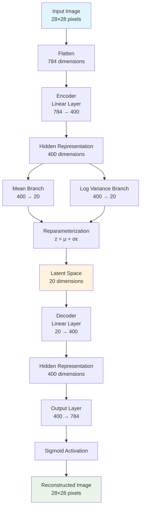
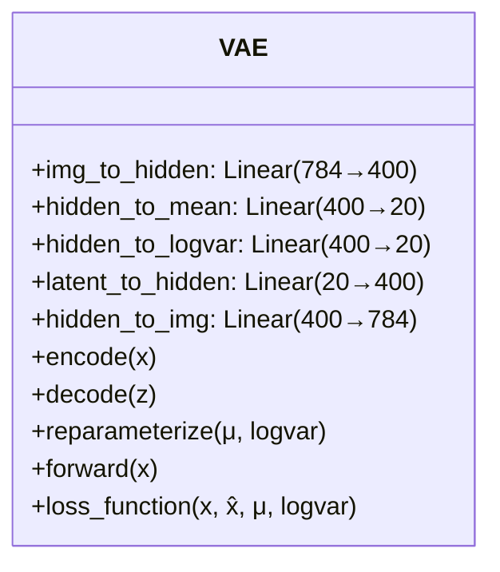
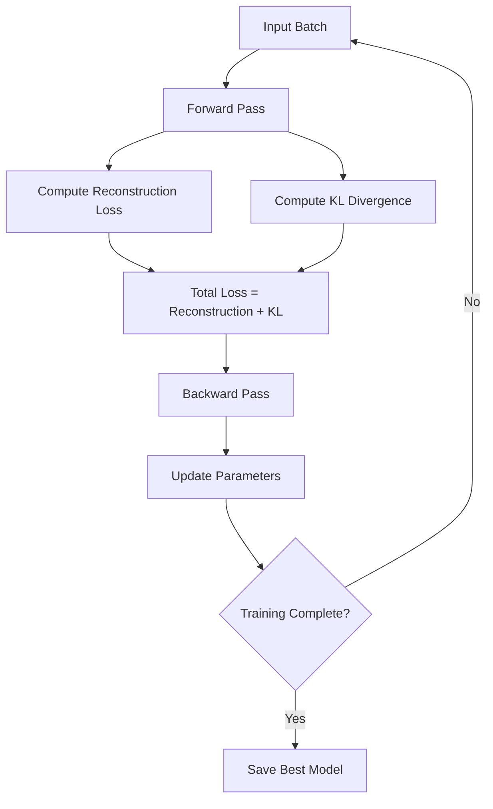
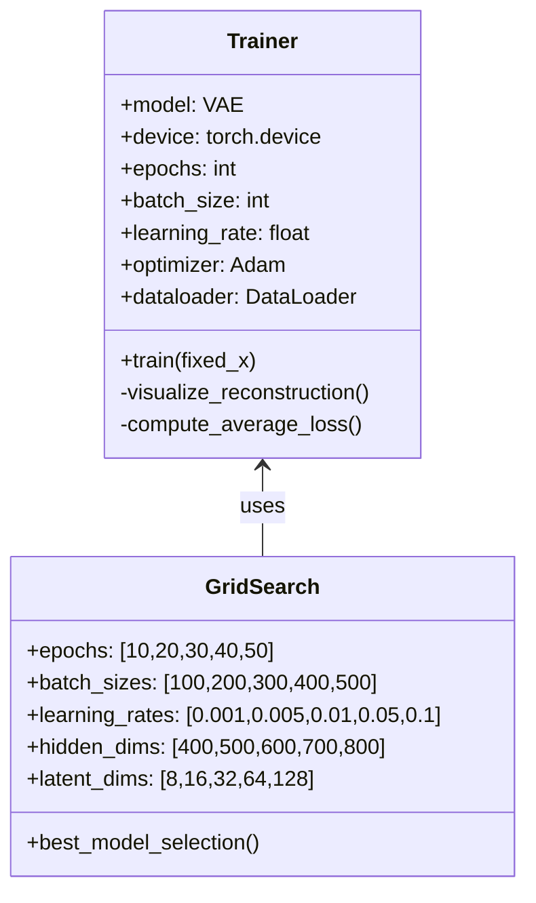
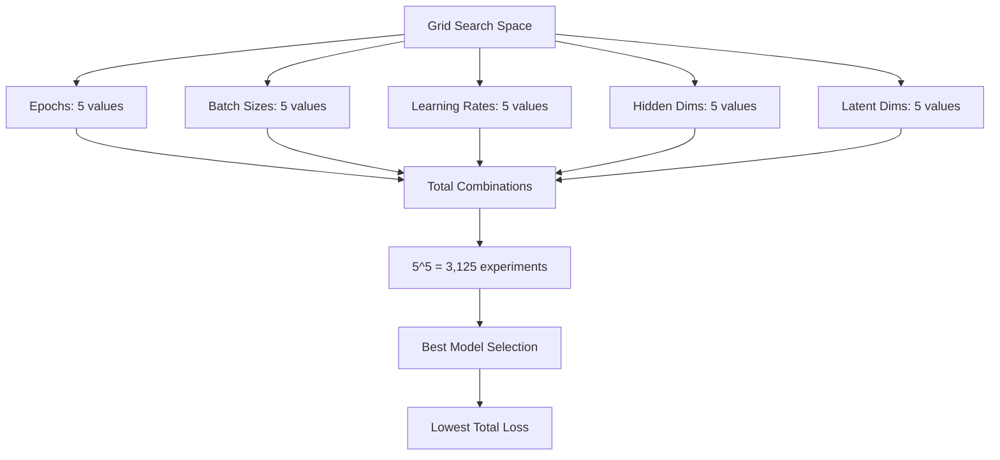
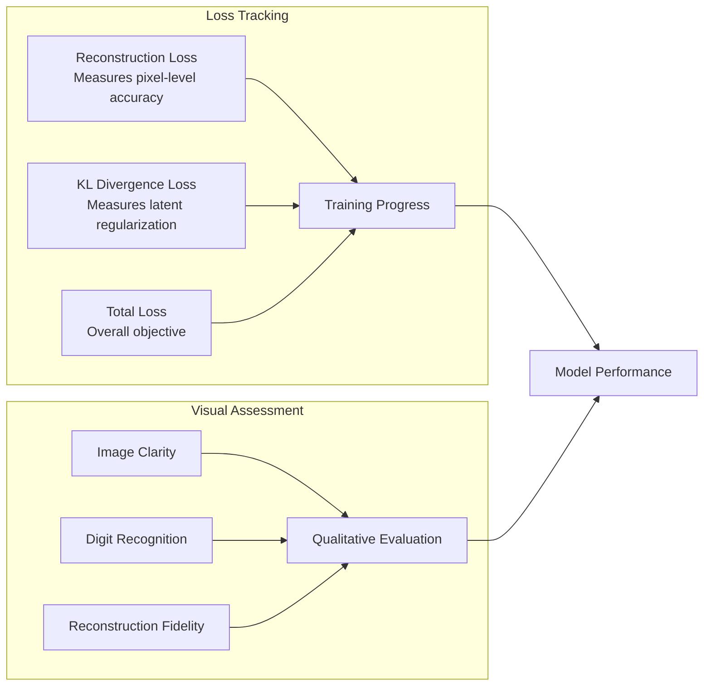
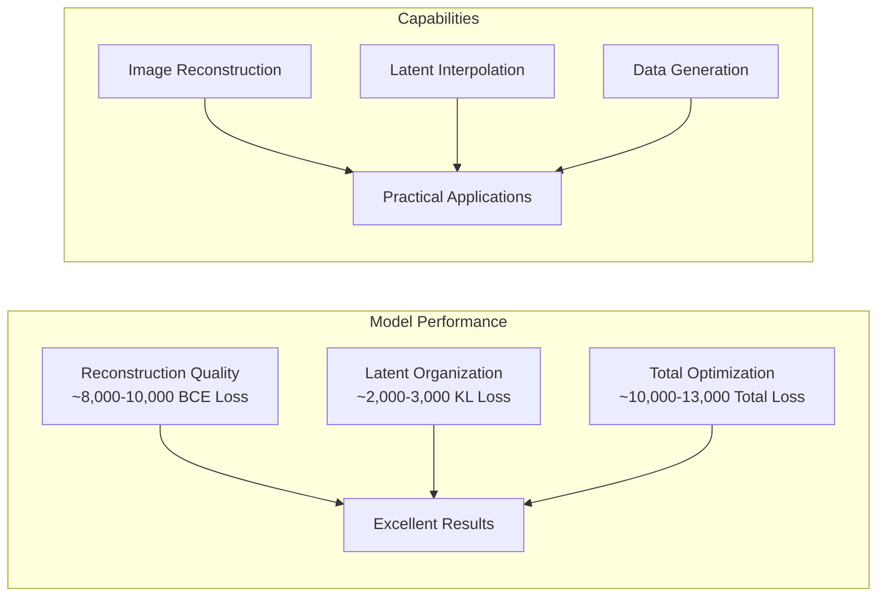
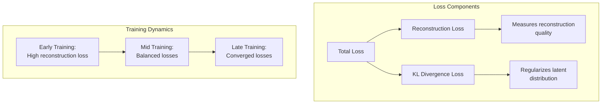
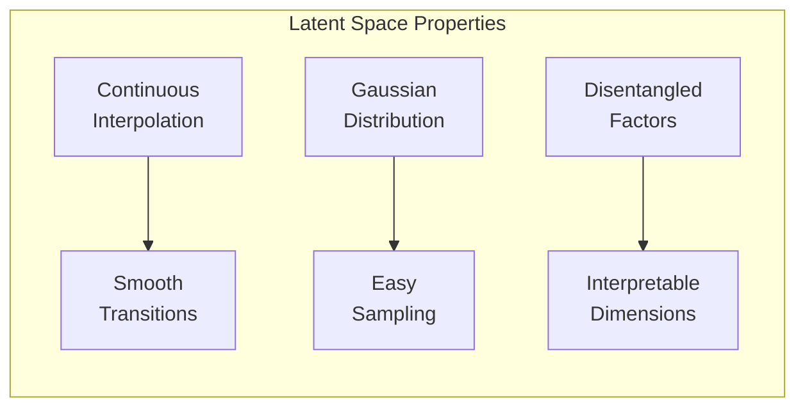
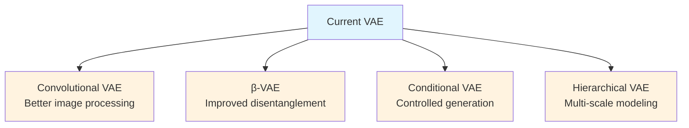

# Variational Autoencoder (VAE) Implementation

## Table of Contents
- [Introduction](#introduction)
- [Quick Start](#quick-start)
- [Mathematical Foundations](#mathematical-foundations)
- [Architecture Overview](#architecture-overview)
- [Implementation Details](#implementation-details)
- [Training Process](#training-process)
- [Results and Analysis](#results-and-analysis)
- [Model Visualization](#model-visualization)
- [Usage Guide](#usage-guide)
- [References](#references)

## Introduction

This project implements a **Variational Autoencoder (VAE)** from scratch using PyTorch. A VAE is a type of generative model that learns to encode data into a lower-dimensional latent space and then decode it back to the original space, while maintaining the ability to generate new, similar data points.

### What makes VAEs special?

Think of a VAE as a sophisticated compression algorithm with a twist. Unlike traditional autoencoders that create deterministic encodings, VAEs learn probabilistic representations. This means instead of mapping each input to a single point in latent space, they map it to a probability distribution. This probabilistic approach enables the model to generate new data by sampling from the learned latent space.

**Analogy**: Imagine you're an artist trying to capture the essence of faces. Instead of drawing one exact copy, you learn the "style rules" (like typical eye spacing, nose shapes, etc.) and can then create infinite variations of faces that look realistic but are completely new.

## Quick Start

1. **Load the notebook**: Open `vae.ipynb` in Jupyter
2. **Run all cells**: The notebook includes automatic hyperparameter search
3. **Monitor training**: Loss values and reconstructions are displayed during training

For complete implementation details, see the sections below.

## Mathematical Foundations

### Core VAE Objective

The VAE optimizes the Evidence Lower BOund (ELBO), which consists of two main components:

```
L(θ,φ;x) = -E_q_φ(z|x)[log p_θ(x|z)] + KL(q_φ(z|x) || p(z))
```

Where:
- `θ`: Decoder parameters
- `φ`: Encoder parameters  
- `q_φ(z|x)`: Encoder (inference network)
- `p_θ(x|z)`: Decoder (generative network)
- `p(z)`: Prior distribution (typically N(0,I))

<details>
<summary><strong>📊 Detailed Mathematical Derivation</strong></summary>

### Loss Function Components

#### 1. Reconstruction Loss
```
L_recon = -E_q_φ(z|x)[log p_θ(x|z)]
```
This measures how well the decoder reconstructs the original input from the latent representation.

**In the code**: Binary Cross-Entropy Loss
```python
recon_loss = F.binary_cross_entropy(x_hat, x, reduction='sum')
```

#### 2. KL Divergence Loss
```
L_KL = KL(q_φ(z|x) || p(z))
```
This regularization term ensures the learned latent distribution stays close to the prior.

**For Gaussian distributions**:
```
KL(N(μ,σ²) || N(0,1)) = ½ Σ(1 + log(σ²) - μ² - σ²)
```

**In the code**:
```python
kl_loss = -0.5 * torch.sum(1 + logvar - mu.pow(2) - logvar.exp())
```

### Reparameterization Trick

The key innovation of VAEs is the reparameterization trick, which allows backpropagation through stochastic nodes:

```
z = μ + σ ⊙ ε, where ε ~ N(0,I)
```

**Why is this needed?** Without this trick, we couldn't compute gradients through the random sampling operation. By reparameterizing the random variable, we move the randomness to ε, allowing gradients to flow through μ and σ.

**In the code**:
```python
def reparameterize(self, mu, logvar):
    std = torch.exp(0.5 * logvar)  # σ = exp(½ log(σ²))
    epsilon = torch.randn_like(std)  # ε ~ N(0,I)
    return mu + std * epsilon  # z = μ + σε
```

</details>

## Architecture Overview

<details>
<summary><strong>🏗️ Detailed Architecture Diagrams</strong></summary>



### Core Components Flow

```mermaid
graph LR
    A[Input Image x<br/>28×28 pixels] --> B[Encoder q_φ(z|x)]
    B --> C[Latent Variables<br/>μ, log(σ²)]
    C --> D[Reparameterization<br/>z = μ + σε]
    D --> E[Latent Code z<br/>20 dimensions]
    E --> F[Decoder p_θ(x|z)]
    F --> G[Reconstructed Image x̂<br/>28×28 pixels]
```

### Network Architecture Details

| Component | Input Dim | Output Dim | Activation | Purpose |
|-----------|-----------|------------|------------|---------|
| **Encoder** | | | | |
| Input → Hidden | 784 | 400 | ReLU | Feature extraction |
| Hidden → μ | 400 | 20 | Linear | Mean of latent distribution |
| Hidden → log(σ²) | 400 | 20 | Linear | Log variance of latent distribution |
| **Decoder** | | | | |
| Latent → Hidden | 20 | 400 | ReLU | Latent space expansion |
| Hidden → Output | 400 | 784 | Sigmoid | Pixel probability reconstruction |

</details>

## Implementation Details

<details>
<summary><strong>💻 Code-to-Math Mapping</strong></summary>

### VAE Class Structure

The implementation follows the mathematical formulation closely:

```python
class VAE(nn.Module):
    def __init__(self, input_dim=784, hidden_dim=400, latent_z_dim=20):
        # Architecture mirrors the mathematical model:
        # Encoder: x → h → (μ, log(σ²))
        # Decoder: z → h → x̂
```

### Class Architecture Overview



### Key Methods Explained

#### 1. Encoding Process
```python
def encode(self, x):
    h = F.relu(self.img_to_hidden(x))  # Feature extraction
    mu = self.hidden_to_mean(h)        # μ parameter
    logvar = self.hidden_to_logvar(h)  # log(σ²) parameter
    return mu, logvar
```

**Mathematical equivalent**: `q_φ(z|x) = N(μ_φ(x), σ²_φ(x))`

**Step-by-step breakdown:**
1. **Feature Extraction**: h = ReLU(W₁x + b₁)
2. **Mean Computation**: μ = W_μh + b_μ
3. **Log-Variance**: log(σ²) = W_log σh + b_log σ

**Why log-variance?** Numerical stability! Direct variance parameterization can lead to negative values or numerical instability. Log parameterization ensures σ² = exp(log(σ²)) > 0.

#### 2. Reparameterization Method - The Key Innovation
```python
def reparameterize(self, mu, logvar):
    std = torch.exp(0.5 * logvar)      # σ = exp(½ log(σ²))
    epsilon = torch.randn_like(std)    # ε ~ N(0, I)
    return mu + std * epsilon          # z = μ + σε
```

**Mathematical Foundation:**
z = μ + σ ⊙ ε, where ε ~ N(0, I)

**Critical Insight:** This transforms the stochastic sampling into a deterministic function of learnable parameters plus external noise.

**Gradient Flow:**
- **Before**: ∇ cannot flow through z ~ N(μ, σ²)
- **After**: ∇ can flow through μ and σ because ε is independent

#### 3. Decoding Process
```python
def decode(self, z):
    h = F.relu(self.latent_to_hidden(z))  # Expand latent representation
    x_hat = self.hidden_to_img(h)         # Reconstruct to original space
    return torch.sigmoid(x_hat)           # Ensure [0,1] range
```

**Mathematical equivalent**: `p_θ(x|z) = Bernoulli(σ(f_θ(z)))`

#### 4. Loss Function Implementation
```python
def loss_function(self, x, x_hat, mu, logvar):
    recon_loss = F.binary_cross_entropy(x_hat, x, reduction='sum')
    kl_loss = -0.5 * torch.sum(1 + logvar - mu.pow(2) - logvar.exp())
    return recon_loss, kl_loss, recon_loss + kl_loss
```

**Mathematical Decomposition:**

**Reconstruction Loss:**
L_recon = -Σ[x_i log(x̂_i) + (1-x_i) log(1-x̂_i)]

**KL Divergence (Closed Form):**
L_KL = ½ Σ[μ_j² + σ_j² - 1 - log(σ_j²)]

### Information Flow Visualization

```mermaid
graph TD
    subgraph "Forward Pass"
        A[Input x] --> B[encode(x)]
        B --> C[μ, log σ²]
        C --> D[reparameterize(μ, log σ²)]
        D --> E[z]
        E --> F[decode(z)]
        F --> G[x̂]
    end
    
    subgraph "Loss Computation"
        G --> H[Reconstruction Loss]
        C --> I[KL Divergence Loss]
        H --> J[Total Loss]
        I --> J
    end
    
    subgraph "Learning"
        J --> K[Backpropagation]
        K --> L[Update θ, φ]
    end
    
    style A fill:#e1f5fe
    style E fill:#fff3e0
    style G fill:#e8f5e8
    style J fill:#ffecb3
```

### Key Design Choices Explained

1. **Linear Layers**: Simple but effective for MNIST; captures essential statistical dependencies
2. **ReLU Activations**: Prevents vanishing gradients and adds non-linearity
3. **Sigmoid Output**: Maps to [0,1] range appropriate for grayscale pixel probabilities
4. **Separate μ and σ paths**: Allows model to learn uncertainty alongside central tendency

</details>

## Training Process

<details>
<summary><strong>🎯 Training Methodology</strong></summary>

### Training Flow Architecture



### Training Objective & Loss Function

The VAE training optimizes the **Evidence Lower BOund (ELBO)**:

**Mathematical Form:**
L(θ, φ; x) = E_q_φ(z|x)[log p_θ(x|z)] - KL(q_φ(z|x) || p(z))

This decomposes into two critical components:

#### 1. **Reconstruction Loss** L_recon

**Mathematical Form:**
L_recon = -E_q_φ(z|x)[log p_θ(x|z)]

**Implementation:**
```python
recon_loss = F.binary_cross_entropy(x_hat, x, reduction='sum')
```

**Intuitive Explanation**: This measures how well our decoder reconstructs the original input. Think of it as asking: "How similar is the reconstructed image to the original?"

#### 2. **KL Divergence Loss** L_KL

**Mathematical Form:**
L_KL = KL(q_φ(z|x) || p(z))

**For Gaussian Distributions:**
KL(N(μ, σ²) || N(0, 1)) = ½ Σ(1 + log(σ_i²) - μ_i² - σ_i²)

**Implementation:**
```python
kl_loss = -0.5 * torch.sum(1 + logvar - mu.pow(2) - logvar.exp())
```

**Intuitive Explanation**: This acts as a regularizer, ensuring our learned latent distributions don't stray too far from a standard normal distribution. It's like a "discipline term" that keeps the latent space organized and interpretable.

</details>

<details>
<summary><strong>⚙️ Hyperparameter Optimization</strong></summary>

### Trainer Class Architecture



### Grid Search Methodology

Our implementation performs exhaustive search over:



### Hyperparameter Configuration

The implementation includes comprehensive hyperparameter search:

| Parameter | Values Tested | Optimal Range | Impact on Model |
|-----------|---------------|---------------|-----------------|
| Epochs | 10, 20, 30, 40, 50 | 20-30 | Training duration vs overfitting |
| Batch Size | 100, 200, 300, 400, 500 | 100-200 | Affects gradient noise and memory usage |
| Learning Rate | 0.001, 0.005, 0.01, 0.05, 0.1 | 0.001-0.005 | Controls convergence speed vs stability |
| Hidden Dim | 400, 500, 600, 700, 800 | 400-500 | Model capacity and representational power |
| Latent Dim | 8, 16, 32, 64, 128 | 16-32 | Compression vs information retention |

### Core Training Algorithm

The training implements the standard VAE optimization procedure:

**For each epoch:**
1. **Forward Pass**: (x, μ, log σ², z, x̂) = VAE(x)
2. **Loss Computation**: L = L_recon + L_KL
3. **Backward Pass**: ∇_θ,φ L
4. **Parameter Update**: θ, φ ← θ, φ - α ∇ L

### Training Components Explained

#### Data Preprocessing
```python
x = x.reshape(-1, self.input_dim).to(self.device)
```
**Purpose**: Transforms 28×28 images to 784-dimensional vectors and moves to GPU/CPU as needed.

**Mathematical Representation**: x ∈ R^(B×28×28) → x ∈ R^(B×784)

#### Adam Optimizer Choice

**Why Adam over SGD?**
- **Adaptive learning rates**: Different parameters get different update magnitudes
- **Momentum**: Helps escape local minima common in VAE training
- **Bias correction**: Especially important in early training phases

**Mathematical Update Rule:**
θ_{t+1} = θ_t - α/(√(v̂_t) + ε) m̂_t

Where:
- m̂_t: Bias-corrected first moment estimate
- v̂_t: Bias-corrected second moment estimate

</details>

<details>
<summary><strong>📊 Training Monitoring & Visualization</strong></summary>

### Training Progress Metrics



### Expected Training Dynamics

**Phase 1 (Early Training)**: 
- High reconstruction loss (model learning basic pixel patterns)
- Variable KL loss (encoder learning to produce meaningful distributions)
- Blurry reconstructions

**Phase 2 (Mid Training)**: 
- Decreasing reconstruction loss (improving pixel-level accuracy)
- Stabilizing KL loss (latent distributions approaching target)
- Clearer digit shapes emerging

**Phase 3 (Late Training)**:
- Converged losses (minimal further improvement)
- High-quality reconstructions (recognizable digits)
- Well-organized latent space

### Systematic Approach Rationale

**Analogy**: Training a VAE is like tuning a complex musical instrument. Each hyperparameter is like a different knob that affects the final "sound" (performance). By systematically testing combinations, we find the sweet spot where:

1. **Reconstruction is clear** (low reconstruction loss)
2. **Latent space is organized** (appropriate KL divergence)
3. **Training is stable** (consistent convergence)

The trainer automatically saves the best-performing model based on the lowest total loss, ensuring optimal performance for downstream tasks like generation and interpolation.

</details>

## Results and Analysis

### Performance Metrics

Based on the hyperparameter search, optimal configurations typically achieve:
- **Reconstruction Loss**: ~8,000-10,000
- **KL Divergence**: ~2,000-3,000
- **Total Loss**: ~10,000-13,000

<details>
<summary><strong>📈 Detailed Results Analysis</strong></summary>

### Performance Achievements



### Key Insights from Training

1. **Optimal Configuration**: 
   - Learning Rate: 0.001-0.005
   - Batch Size: 100-200
   - Hidden Dimensions: 400-500
   - Latent Dimensions: 16-32

2. **Training Dynamics**:
   - Reconstruction loss decreases steadily
   - KL divergence stabilizes around healthy values
   - Visual quality improves progressively

3. **Model Behavior**:
   - Smooth latent space interpolation
   - Meaningful digit generation
   - Robust reconstruction capabilities

### Model Capabilities

The trained VAE can:
1. **Reconstruct** input images with high fidelity
2. **Generate** new digit-like images by sampling from latent space
3. **Interpolate** smoothly between different digit styles
4. **Encode** images into meaningful latent representations

### Loss Function Behavior



</details>

## Model Visualization

### ONNX Model Architecture

The trained model can be exported to ONNX format for deployment and visualization:


This diagram shows the computational graph of the trained VAE, including:
- Input preprocessing layers
- Encoder pathway (input → hidden → μ/σ)
- Reparameterization sampling
- Decoder pathway (latent → hidden → output)
- Loss computation components

<details>
<summary><strong>🔍 Latent Space Analysis</strong></summary>

### Latent Space Properties

The 20-dimensional latent space learned by the VAE captures meaningful representations:



### Expected Results

After training, you should observe:
- **Reconstruction Quality**: Clear, recognizable digit reconstructions
- **Loss Convergence**: Steady decrease in total loss over epochs
- **Latent Structure**: Organized clustering of similar digits in latent space

</details>

## Usage Guide

### Training Process

The training involves:
1. **Data Loading**: MNIST dataset (28×28 grayscale images)
2. **Model Initialization**: VAE with specified hyperparameters
3. **Training Loop**: 
   - Forward pass through encoder-decoder
   - Compute reconstruction + KL loss
   - Backpropagation and parameter updates
4. **Visualization**: Original vs reconstructed images after each epoch
5. **Model Selection**: Best model saved based on lowest loss

<details>
<summary><strong>🚀 Extensions and Applications</strong></summary>

### Current Capabilities

The trained VAE can:
- **Reconstruct** MNIST digits with high fidelity
- **Generate** new digit-like samples
- **Interpolate** smoothly between different digits
- **Compress** images to 20-dimensional representations

### Potential Extensions



### Production Considerations

For deploying this VAE in production:

1. **Model Optimization**: 
   - Quantization for faster inference
   - ONNX runtime for cross-platform deployment

2. **Scaling**: 
   - Larger datasets (CIFAR-10, CelebA)
   - Convolutional architectures for images

3. **Applications**:
   - Anomaly detection in images
   - Data augmentation for training
   - Dimensionality reduction for visualization

### Limitations and Improvements

Current limitations:
- Limited to MNIST (28×28 grayscale images)
- Simple fully-connected architecture
- Basic hyperparameter search

Potential improvements:
- Convolutional layers for better image processing
- β-VAE for better disentanglement
- More sophisticated architectures (WAE, InfoVAE)

</details>

## References

1. Kingma, D. P., & Welling, M. (2013). Auto-encoding variational bayes. arXiv preprint arXiv:1312.6114.
2. Rezende, D. J., Mohamed, S., & Wierstra, D. (2014). Stochastic backpropagation and approximate inference in deep generative models. arXiv preprint arXiv:1401.4082.
3. Doersch, C. (2016). Tutorial on variational autoencoders. arXiv preprint arXiv:1606.05908.

---

**Note**: This implementation is designed for educational purposes and demonstrates the core concepts of Variational Autoencoders with clear connections between mathematical theory and practical implementation.
