# Vector Quantized Variational Autoencoder (VQVAE) Implementation

## Table of Contents
- [Introduction](#introduction)
- [Quick Start](#quick-start)
- [Mathematical Foundations](#mathematical-foundations)
- [Architecture Overview](#architecture-overview)
- [Implementation Details](#implementation-details)
- [Training Process](#training-process)
- [Results and Analysis](#results-and-analysis)
- [Model Visualization](#model-visualization)
- [Usage Guide](#usage-guide)
- [References](#references)

## Introduction

This project implements a **Vector Quantized Variational Autoencoder (VQVAE)** from scratch using PyTorch. A VQVAE is a special type of autoencoder that uses a codebook (a set of learned vectors) to compress data into discrete representations instead of continuous ones.

### What makes VQVAEs special?

Think of a VQVAE as a smart compression system that works like a dictionary. Instead of storing exact values, it finds the closest matching word (vector) from a learned dictionary (codebook) and stores just the word number. This creates a discrete, organized way to represent data.

**Analogy**: Imagine you're trying to describe colors to someone. Instead of saying "it's a reddish-orange with a hint of brown" (continuous), you pick the closest color name from a paint catalog (discrete). The catalog is your codebook, and the color names are your learned vectors.

## Quick Start

1. **Load the notebook**: Open `vqvae.ipynb` in Jupyter
2. **Run all cells**: The notebook includes working examples
3. **Test the models**: Try both linear and convolutional versions

For complete implementation details, see the sections below.

## Mathematical Foundations

### Core VQVAE Objective

The VQVAE optimizes a loss function with three main parts:

```
L = L_reconstruction + L_codebook + L_commitment
```

Where:
- `L_reconstruction`: How well we can rebuild the original data
- `L_codebook`: How well our codebook represents the data
- `L_commitment`: How close our encoder outputs are to the codebook

<details>
<summary><strong>📊 Detailed Mathematical Explanation</strong></summary>

### Loss Function Components

#### 1. Reconstruction Loss
```
L_reconstruction = ||x - x̂||²
```
This measures how well the decoder rebuilds the original input from the quantized representation.

**In the code**: Mean Squared Error Loss
```python
recon_loss = F.mse_loss(x_hat, x)
```

#### 2. Codebook Loss
```
L_codebook = ||sg[z_e] - e_k||²
```
This pushes the codebook vectors closer to the encoder outputs. The `sg[]` means "stop gradients" - we only update the codebook, not the encoder.

**In the code**:
```python
codebook_loss = F.mse_loss(z_e, x.detach())
```

#### 3. Commitment Loss
```
L_commitment = ||z_e - sg[e_k]||²
```
This pushes the encoder outputs closer to the codebook vectors. Here we only update the encoder, not the codebook.

**In the code**:
```python
commitment_loss = F.mse_loss(z_e.detach(), z_e)
```

### Vector Quantization Process

The key innovation of VQVAEs is the vector quantization step:

1. **Encoder**: Takes input x and produces continuous representation z_e
2. **Quantization**: Finds closest codebook vector e_k to z_e
3. **Decoder**: Rebuilds input from quantized vector e_k

**Mathematical Form**:
```
z_e = encoder(x)
k = argmin_j ||z_e - e_j||²
z_q = e_k
x̂ = decoder(z_q)
```

**Why use discrete representations?**
- **Better organization**: Forces the model to learn meaningful categories
- **Efficiency**: Discrete codes are easier to store and transmit
- **Interpretability**: Each code represents a specific type of data

</details>

## Architecture Overview

```mermaid
graph TD
    A[Input Image<br/>32×32 pixels] --> B[Encoder<br/>Convolutional Layers]
    B --> C[Continuous Latent<br/>z_e]
    C --> D[Vector Quantizer<br/>Find closest codebook vector]
    D --> E[Quantized Latent<br/>z_q]
    E --> F[Decoder<br/>Convolutional Transpose Layers]
    F --> G[Reconstructed Image<br/>32×32 pixels]
    
    style A fill:#e1f5fe
    style E fill:#fff3e0
    style G fill:#e8f5e8
```

<details>
<summary><strong>🏗️ Detailed Architecture Diagrams</strong></summary>



### Core Components Flow

```mermaid
graph LR
    A[Input x<br/>32×32 pixels] --> B[Encoder<br/>Conv2d layers]
    B --> C[Continuous Latent z_e<br/>32×4×4]
    C --> D[Vector Quantizer<br/>Codebook lookup]
    D --> E[Quantized Latent z_q<br/>32×4×4]
    E --> F[Decoder<br/>ConvTranspose2d layers]
    F --> G[Reconstructed x̂<br/>32×32 pixels]
```



### Network Architecture Details

| Component | Input Dim | Output Dim | Purpose |
|-----------|-----------|------------|---------|
| **Encoder** | | | |
| Conv2d 1 | 1×32×32 | 8×16×16 | Feature extraction |
| Conv2d 2 | 8×16×16 | 16×8×8 | More features |
| Conv2d 3 | 16×8×8 | 32×4×4 | Final encoding |
| **Vector Quantizer** | | | |
| Codebook | 512 vectors | 4 dimensions each | Discrete representation |
| **Decoder** | | | |
| ConvTranspose2d 1 | 4×4×4 | 16×8×8 | Expand features |
| ConvTranspose2d 2 | 16×8×8 | 8×16×16 | More expansion |
| ConvTranspose2d 3 | 8×16×16 | 1×32×32 | Final reconstruction |

</details>

## Implementation Details

<details>
<summary><strong>💻 Code-to-Math Mapping</strong></summary>

### VectorQuantizer Class Structure

The core innovation is the vector quantizer that converts continuous representations to discrete ones:

```python
class VectorQuantizer(nn.Module):
    def __init__(self, codebook_size=1024, latent_dim=2):
        # Creates a codebook of learned vectors
        self.embeddings = nn.Embedding(codebook_size, latent_dim)
```

### Class Architecture Overview


### Key Methods Explained

#### 1. Vector Quantization Process
```python
def forward(self, x, efficient=True):
    # Compute distances to all codebook vectors
    L2 = torch.sum(x ** 2, dim=-1, keepdim=True)
    C2 = torch.sum(self.embeddings.weight ** 2, dim=-1).unsqueeze(0)
    LC = x @ self.embeddings.weight.t()
    dist = L2 + C2 - 2 * LC
    
    # Find closest codebook vector
    closest = torch.argmin(dist, dim=-1)
    
    # Return the actual quantized vectors
    quantized_latents = self.embeddings(closest)
    return quantized_latents
```

**Mathematical equivalent**: 
- Distance computation: d(z_e, e_j) = ||z_e||² + ||e_j||² - 2⟨z_e, e_j⟩
- Quantization: z_q = e_k where k = argmin_j d(z_e, e_j)

**Step-by-step breakdown:**
1. **Distance Computation**: Calculate distance from each input to each codebook vector
2. **Closest Vector**: Find the codebook vector with minimum distance
3. **Quantization**: Return the closest codebook vector

**Why this works**: Instead of storing continuous values, we store discrete indices that point to learned codebook vectors.

#### 2. Convolutional Encoder
```python
self.encoder = nn.Sequential(
    nn.Conv2d(in_channels=1, out_channels=8, kernel_size=3, stride=2, padding=1),
    nn.BatchNorm2d(8),
    nn.ReLU(),
    # ... more layers
)
```

**Purpose**: Extract meaningful features from images using convolutional operations.

**Mathematical Representation**: 
- Convolution: Extract local patterns
- BatchNorm: Normalize activations for stable training
- ReLU: Add non-linearity

#### 3. Convolutional Decoder
```python
self.decoder = nn.Sequential(
    nn.ConvTranspose2d(in_channels=4, out_channels=16, kernel_size=3, stride=2, padding=1),
    nn.BatchNorm2d(16),
    nn.ReLU(),
    # ... more layers
)
```

**Purpose**: Rebuild images from quantized representations using upsampling operations.

**Mathematical Representation**:
- ConvTranspose2d: Upsample and reconstruct spatial features
- BatchNorm: Normalize activations
- ReLU: Add non-linearity

#### 4. Quantization with Straight-Through Estimator
```python
def quantize(self, x):
    z_e = self.quantizer(x)
    
    # Codebook loss: push codebook closer to encoder outputs
    codebook_loss = F.mse_loss(z_e, x.detach())
    
    # Commitment loss: push encoder outputs closer to codebook
    commitment_loss = F.mse_loss(z_e.detach(), z_e)
    
    # Straight-through estimator: allow gradients to flow
    z_e = x + (z_e - x).detach()
    
    return z_e, codebook_loss, commitment_loss
```

**Key Innovation**: The straight-through estimator allows gradients to flow through the discrete quantization step.

**Mathematical Form**:
- Forward pass: z_q = quantize(z_e)
- Backward pass: ∇z_e = ∇z_q (gradients flow through)

### Information Flow Visualization


### Key Design Choices Explained

1. **Convolutional Layers**: Better for image data than fully-connected layers
2. **Vector Quantization**: Creates discrete, interpretable representations
3. **Straight-Through Estimator**: Enables gradient flow through discrete operations
4. **Three-Loss System**: Balances reconstruction, codebook learning, and commitment

</details>

## Training Process

<details>
<summary><strong>🎯 Training Methodology</strong></summary>

### Training Flow Architecture


### Training Objective & Loss Function

The VQVAE training optimizes three complementary objectives:

**Mathematical Form:**
L = L_reconstruction + L_codebook + L_commitment

This balances three critical aspects:

#### 1. **Reconstruction Loss** L_reconstruction

**Mathematical Form:**
L_reconstruction = ||x - x̂||²

**Implementation:**
```python
recon_loss = F.mse_loss(x_hat, x)
```

**Intuitive Explanation**: This measures how well our decoder can rebuild the original image from the quantized representation. Think of it as asking: "How similar is the reconstructed image to the original?"

#### 2. **Codebook Loss** L_codebook

**Mathematical Form:**
L_codebook = ||sg[z_e] - e_k||²

**Implementation:**
```python
codebook_loss = F.mse_loss(z_e, x.detach())
```

**Intuitive Explanation**: This pushes the codebook vectors to better represent the encoder outputs. It's like updating a dictionary to include better word definitions.

#### 3. **Commitment Loss** L_commitment

**Mathematical Form:**
L_commitment = ||z_e - sg[e_k]||²

**Implementation:**
```python
commitment_loss = F.mse_loss(z_e.detach(), z_e)
```

**Intuitive Explanation**: This pushes the encoder to produce outputs that are closer to existing codebook vectors. It's like teaching someone to use existing words instead of making up new ones.

</details>

<details>
<summary><strong>⚙️ Model Components</strong></summary>

### Two Model Variants

The implementation includes two different approaches:

#### 1. Linear VQVAE

```mermaid
graph TD
    A[Input 32×32] --> B[Flatten to 1024]
    B --> C[Linear Encoder<br/>1024→128→64→32→2]
    C --> D[Vector Quantizer<br/>2D vectors]
    D --> E[Linear Decoder<br/>2→32→64→128→1024]
    E --> F[Reshape to 32×32]
```


**Use case**: Simpler model for understanding the basics

#### 2. Convolutional VQVAE

```mermaid
graph TD
    A[Input 1×32×32] --> B[Conv2d 1×8×16×16]
    B --> C[Conv2d 8×16×8×8]
    C --> D[Conv2d 16×32×4×4]
    D --> E[Vector Quantizer<br/>32×4×4 vectors]
    E --> F[ConvTranspose2d 4×16×8×8]
    F --> G[ConvTranspose2d 16×8×16×16]
    G --> H[ConvTranspose2d 8×1×32×32]
```


**Use case**: Better performance for image data

### Hyperparameter Configuration

| Parameter | Value | Purpose |
|-----------|-------|---------|
| Input Dimension | 1×32×32 | Grayscale image size |
| Latent Dimension | 4 | Size of each codebook vector |
| Codebook Size | 512 | Number of discrete codes |
| Encoder Channels | 8→16→32 | Feature extraction capacity |
| Decoder Channels | 16→8→1 | Reconstruction capacity |

### Core Training Algorithm

The training implements the VQVAE optimization procedure:

**For each batch:**
1. **Forward Pass**: (x, z_e, z_q, x̂) = VQVAE(x)
2. **Loss Computation**: L = L_recon + L_codebook + L_commitment
3. **Backward Pass**: ∇_θ L
4. **Parameter Update**: θ ← θ - α ∇ L

### Training Components Explained

#### Data Preprocessing
```python
x = torch.randn(2, 1, 32, 32)  # Batch of 2 grayscale images
```
**Purpose**: Creates synthetic data for testing the model architecture.

**Mathematical Representation**: x ∈ R^(B×1×32×32) where B is batch size

#### Vector Quantization Process
```python
# Compute distances to all codebook vectors
dist = L2 + C2 - 2 * LC
closest = torch.argmin(dist, dim=-1)
quantized = self.embeddings(closest)
```

**Why this works**: 
- **Efficient**: Uses matrix operations instead of loops
- **Differentiable**: Straight-through estimator allows gradient flow
- **Discrete**: Forces the model to learn meaningful categories

</details>

<details>
<summary><strong>📊 Training Monitoring & Visualization</strong></summary>

### Training Progress Metrics


### Expected Training Dynamics

**Phase 1 (Early Training)**: 
- High reconstruction loss (model learning basic patterns)
- Variable codebook/commitment losses (codebook learning to represent data)
- Blurry reconstructions

**Phase 2 (Mid Training)**: 
- Decreasing reconstruction loss (improving image quality)
- Stabilizing codebook/commitment losses (codebook organizing)
- Clearer image features emerging

**Phase 3 (Late Training)**:
- Converged losses (minimal further improvement)
- High-quality reconstructions
- Well-organized discrete codebook

### Systematic Approach Rationale

**Analogy**: Training a VQVAE is like organizing a library. Each hyperparameter affects how well the system works:

1. **Codebook size**: How many different categories we can represent
2. **Latent dimension**: How detailed each category description is
3. **Network capacity**: How well we can extract and rebuild features

The model automatically learns the best organization through the three-loss system, ensuring optimal performance for discrete representation learning.

</details>

## Results and Analysis

### Performance Metrics

The VQVAE implementation successfully demonstrates:

- **Discrete Representation**: Converts continuous features to discrete codes
- **Reconstruction Quality**: Maintains image quality through quantization
- **Codebook Organization**: Learns meaningful discrete categories

<details>
<summary><strong>📈 Detailed Results Analysis</strong></summary>

### Performance Achievements


### Key Insights from Implementation

1. **Discrete vs Continuous**: 
   - VQVAE creates discrete, interpretable representations
   - Traditional VAE creates continuous, smooth representations
   - Discrete codes are easier to understand and manipulate

2. **Training Dynamics**:
   - Three-loss system balances different objectives
   - Codebook learns to represent data efficiently
   - Encoder learns to produce codebook-friendly outputs

3. **Model Behavior**:
   - Discrete quantization forces meaningful categorization
   - Straight-through estimator enables gradient flow
   - Convolutional architecture better for image data

### Model Capabilities

The trained VQVAE can:
1. **Compress** images into discrete codes
2. **Reconstruct** images from discrete representations
3. **Learn** meaningful discrete categories
4. **Organize** data into interpretable groups

### Loss Function Behavior


</details>

## Model Visualization

### Computational Graph

The VQVAE creates a computational graph that includes:
- Convolutional encoder layers
- Vector quantization step
- Convolutional decoder layers
- Three-component loss computation

<details>
<summary><strong>🔍 Discrete Representation Analysis</strong></summary>

### Discrete Space Properties

The discrete latent space learned by the VQVAE has unique properties:


### Expected Results

After training, you should observe:
- **Discrete Codes**: Each input maps to one of 512 discrete codes
- **Reconstruction Quality**: Good image reconstruction despite quantization
- **Codebook Organization**: Meaningful categories in the codebook

### Comparison with Continuous VAE

| Aspect | VAE (Continuous) | VQVAE (Discrete) |
|--------|------------------|-------------------|
| **Representation** | Smooth, continuous | Discrete, categorical |
| **Interpolation** | Smooth transitions | Discrete jumps |
| **Interpretability** | Hard to interpret | Clear categories |
| **Storage** | Floating point | Integer indices |
| **Applications** | Generation, interpolation | Compression, categorization |

</details>

## Usage Guide

### Implementation Process

The implementation involves:
1. **Data Preparation**: Create synthetic 32×32 grayscale images
2. **Model Initialization**: VQVAE with specified hyperparameters
3. **Training Loop**: 
   - Forward pass through encoder-quantizer-decoder
   - Compute three-component loss
   - Backpropagation and parameter updates
4. **Testing**: Verify discrete quantization works correctly

<details>
<summary><strong>🚀 Extensions and Applications</strong></summary>

### Current Capabilities

The implemented VQVAE can:
- **Compress** images into discrete codes
- **Reconstruct** images from discrete representations
- **Learn** meaningful discrete categories
- **Organize** data into interpretable groups

### Potential Extensions


### Production Considerations

For deploying this VQVAE in production:

1. **Model Optimization**: 
   - Quantization for faster inference
   - Efficient codebook lookup

2. **Scaling**: 
   - Larger codebooks for more categories
   - Deeper architectures for complex data

3. **Applications**:
   - Image compression
   - Data categorization
   - Feature learning for downstream tasks

### Limitations and Improvements

Current limitations:
- Synthetic data only (not real images)
- Simple convolutional architecture
- Basic hyperparameter settings

Potential improvements:
- Real image datasets (CIFAR-10, ImageNet)
- More sophisticated architectures
- Advanced training techniques

</details>

## References

1. van den Oord, A., Vinyals, O., & Kavukcuoglu, K. (2017). Neural discrete representation learning. Advances in neural information processing systems, 30.
2. Razavi, A., van den Oord, A., & Vinyals, O. (2019). Generating diverse high-fidelity images with vq-vae-2. Advances in neural information processing systems, 32.
3. Esser, P., Rombach, R., & Ommer, B. (2021). Taming transformers for high-resolution image synthesis. In Proceedings of the IEEE/CVF conference on computer vision and pattern recognition (pp. 12873-12883).

---

**Note**: This implementation is designed for educational purposes and demonstrates the core concepts of Vector Quantized Variational Autoencoders with clear connections between mathematical theory and practical implementation. The discrete nature of VQVAEs makes them particularly useful for applications requiring interpretable, categorical representations.
