# ResNet Implementation from Scratch

A comprehensive PyTorch implementation of ResNet (Residual Networks) based on the groundbreaking paper ["Deep Residual Learning for Image Recognition"](https://arxiv.org/abs/1512.03385) by Kaiming He et al. (2015).

## Table of Contents
- [Introduction](#introduction)
- [The ResNet Innovation](#the-resnet-innovation)
- [Architecture Overview](#architecture-overview)
- [Implementation Details](#implementation-details)
- [Training Pipeline](#training-pipeline)
- [Usage](#usage)
- [Results](#results)
- [References](#references)

## Introduction

ResNet revolutionized deep learning by solving the degradation problem in very deep neural networks. Before ResNet, training networks with more than 20-30 layers was extremely difficult due to vanishing gradients and degradation issues. ResNet introduced **residual connections** (skip connections) that allow training of networks with hundreds of layers.

### The Core Innovation: Residual Learning

The fundamental insight of ResNet is to learn residual functions instead of direct mappings. Instead of learning `H(x)` directly, the network learns the residual function `F(x) = H(x) - x`, making the final output:

```
H(x) = F(x) + x
```

This simple addition enables:
- **Easier optimization**: If the optimal function is close to identity, it's easier to push residual weights to zero
- **Gradient flow**: Direct paths for gradients to flow through skip connections
- **Deep network training**: Enables training of 50, 101, 152+ layer networks

## Architecture Overview

Our implementation supports multiple ResNet variants:

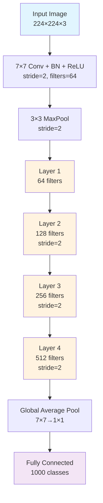

### ResNet Variants Configuration

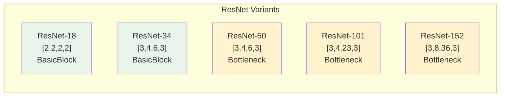

## Implementation Details

### 1. Basic Block (ResNet-18/34)

The `BasicBlock` implements the fundamental residual unit for shallower ResNets:

```python
class BasicBlock(nn.Module):
    """Basic Block for ResNet 18 and 34"""
    expansion = 1
    
    def forward(self, x):
        identity = x  # Store input for skip connection
        
        # First conv block: 3×3 conv + BN + ReLU
        out = self.conv1(x)
        out = self.bn1(out)
        out = self.relu(out)
        
        # Second conv block: 3×3 conv + BN (no ReLU yet)
        out = self.conv2(out)
        out = self.bn2(out)
        
        # Residual connection: H(x) = F(x) + x
        out += self.shortcut(identity)
        out = self.relu(out)  # ReLU after addition
        
        return out
```

#### Basic Block Architecture

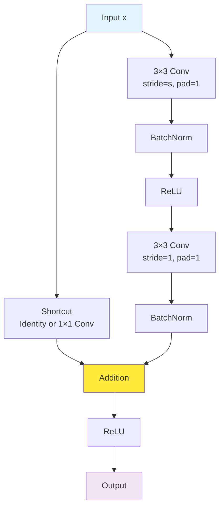

### 2. Bottleneck Block (ResNet-50/101/152)

The `Bottleneck` block uses three convolutions (1×1, 3×3, 1×1) to reduce computational cost:

```python
class Bottleneck(nn.Module):
    """Bottleneck Block for ResNet 50, 101, 152"""
    expansion = 4  # Output channels = input channels × 4
    
    def forward(self, x):
        identity = x
        
        # 1×1 conv: reduce dimensions
        out = self.conv1(x)
        out = self.bn1(out)
        out = self.relu(out)
        
        # 3×3 conv: main computation
        out = self.conv2(out)
        out = self.bn2(out)
        out = self.relu(out)
        
        # 1×1 conv: restore dimensions (×4 expansion)
        out = self.conv3(out)
        out = self.bn3(out)
        
        # Residual connection
        out += self.shortcut(identity)
        out = self.relu(out)
        
        return out
```

#### Bottleneck Block Architecture

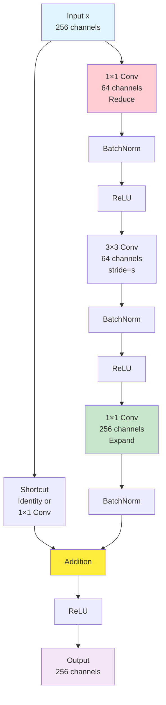

### 3. Skip Connections: The Heart of ResNet

Skip connections handle dimension mismatches through two mechanisms:

#### Identity Shortcut (when dimensions match)
```python
# No transformation needed
self.shortcut = nn.Sequential()
out += identity  # Direct addition
```

#### Projection Shortcut (when dimensions change)
```python
# 1×1 convolution to match dimensions
if stride != 1 or in_channels != out_channels:
    self.shortcut = nn.Sequential(
        nn.Conv2d(in_channels, out_channels, kernel_size=1, stride=stride, bias=False),
        nn.BatchNorm2d(out_channels)
    )
```

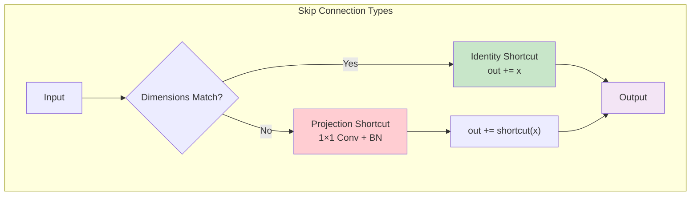

### 4. ResNet Architecture Assembly

The main `ResNet` class orchestrates the entire network:

```python
class ResNet(nn.Module):
    def __init__(self, block, layers, num_classes=1000, in_channels=3):
        # Initial processing
        self.conv1 = nn.Conv2d(in_channels, 64, kernel_size=7, stride=2, padding=3, bias=False)
        self.bn1 = nn.BatchNorm2d(64)
        self.maxpool = nn.MaxPool2d(kernel_size=3, stride=2, padding=1)
        
        # Residual layers
        self.layer1 = self._make_layer(block, 64, layers[0])          # No downsampling
        self.layer2 = self._make_layer(block, 128, layers[1], stride=2)  # 2× downsample
        self.layer3 = self._make_layer(block, 256, layers[2], stride=2)  # 2× downsample  
        self.layer4 = self._make_layer(block, 512, layers[3], stride=2)  # 2× downsample
        
        # Classification head
        self.avgpool = nn.AdaptiveAvgPool2d((1, 1))
        self.fc = nn.Linear(512 * block.expansion, num_classes)
```

#### Layer Construction Process

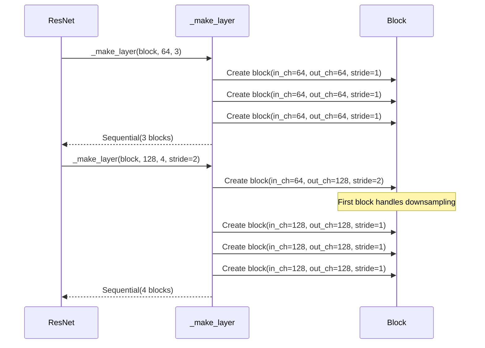

### 5. Data Flow Through ResNet-34

```mermaid
graph TD
    A["Input<br/>224×224×3"] --> B["7×7 Conv, 64<br/>112×112×64"]
    B --> C["3×3 MaxPool<br/>56×56×64"]
    
    C --> D1["BasicBlock 1<br/>56×56×64"]
    D1 --> D2["BasicBlock 2<br/>56×56×64"]
    D2 --> D3["BasicBlock 3<br/>56×56×64"]
    
    D3 --> E1["BasicBlock 1<br/>28×28×128<br/>stride=2"]
    E1 --> E2["BasicBlock 2<br/>28×28×128"]
    E2 --> E3["BasicBlock 3<br/>28×28×128"]
    E3 --> E4["BasicBlock 4<br/>28×28×128"]
    
    E4 --> F1["BasicBlock 1<br/>14×14×256<br/>stride=2"]
    F1 --> F2["BasicBlock 2<br/>14×14×256"]
    F2 --> F3["BasicBlock 3<br/>14×14×256"]
    F3 --> F4["BasicBlock 4<br/>14×14×256"]
    F4 --> F5["BasicBlock 5<br/>14×14×256"]
    F5 --> F6["BasicBlock 6<br/>14×14×256"]
    
    F6 --> G1["BasicBlock 1<br/>7×7×512<br/>stride=2"]
    G1 --> G2["BasicBlock 2<br/>7×7×512"]
    G2 --> G3["BasicBlock 3<br/>7×7×512"]
    
    G3 --> H["Global AvgPool<br/>1×1×512"]
    H --> I["FC Layer<br/>10 classes"]
    
    style A fill:#e1f5fe
    style I fill:#f3e5f5
```

## Training Pipeline

Our implementation includes a comprehensive training pipeline with best practices:

### 1. Data Preprocessing and Augmentation

```python
# Training transforms with data augmentation
train_transform = transforms.Compose([
    transforms.RandomCrop(32, padding=4),      # Random crop with padding
    transforms.RandomHorizontalFlip(p=0.5),   # Random horizontal flip
    transforms.ToTensor(),
    transforms.Normalize((0.4914, 0.4822, 0.4465), (0.2023, 0.1994, 0.2010))
])
```

### 2. Training Configuration

Following the original ResNet paper recommendations:

- **Optimizer**: SGD with momentum=0.9, weight_decay=1e-4
- **Learning Rate**: 0.1 with step decay (÷10 at epochs 100, 150)
- **Batch Size**: 128
- **Epochs**: 200 for CIFAR-10

### 3. Training Process Flow

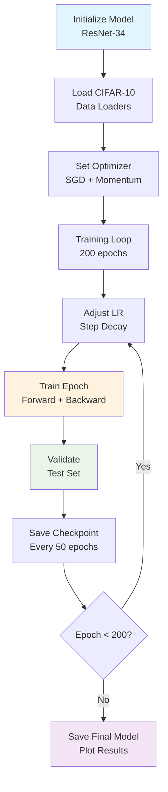

### 4. Learning Rate Schedule

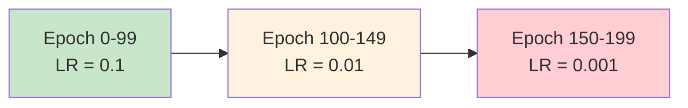

## Usage

### Quick Start

```python
# Import the implementation
from resnet import resnet34

# Create ResNet-34 for CIFAR-10 (10 classes)
model = resnet34(num_classes=10)

# Train the model
model, history = train_resnet34_cifar10(epochs=200, batch_size=128, learning_rate=0.1)

# Plot training curves
plot_training_curves(history)

# Analyze per-class performance
analyze_class_performance(model, test_loader, device)
```

### Available Models

```python
# Different ResNet variants
resnet18(num_classes=10)   # 18-layer ResNet
resnet34(num_classes=10)   # 34-layer ResNet  
resnet50(num_classes=10)   # 50-layer ResNet
resnet101(num_classes=10)  # 101-layer ResNet
resnet152(num_classes=10)  # 152-layer ResNet
```

### Model Architecture Comparison

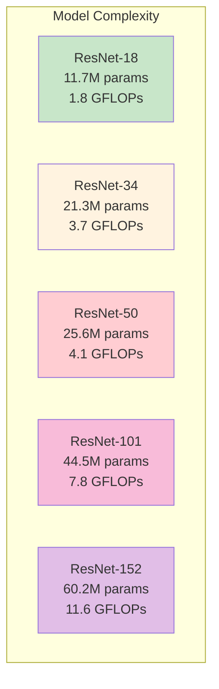

## Results

### Expected Performance on CIFAR-10

| Model | Parameters | Test Accuracy | Training Time (GPU) |
|-------|------------|---------------|-------------------|
| ResNet-18 | 11.2M | ~92-93% | 1-2 hours |
| ResNet-34 | 21.3M | ~93-94% | 2-3 hours |
| ResNet-50 | 23.5M | ~94-95% | 3-4 hours |

### Training Curves Analysis

The implementation provides comprehensive visualization:

1. **Loss Curves**: Training vs validation loss over epochs
2. **Accuracy Curves**: Training vs validation accuracy progression  
3. **Learning Rate Schedule**: Step decay visualization
4. **Per-Class Analysis**: Individual class performance breakdown

### Gradient Flow Visualization

ResNet's key advantage is improved gradient flow:

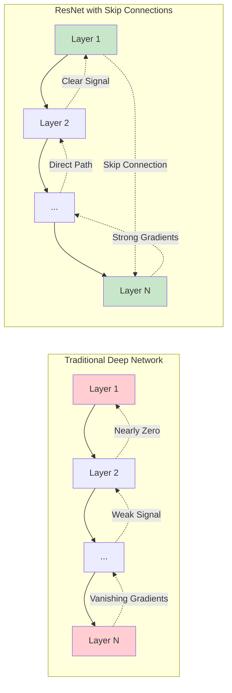

## Key Implementation Features

### 1. Proper Weight Initialization
```python
# Kaiming initialization for Conv2d layers
if isinstance(m, nn.Conv2d):
    nn.init.kaiming_normal_(m.weight, mode='fan_out', nonlinearity='relu')
elif isinstance(m, nn.BatchNorm2d):
    nn.init.constant_(m.weight, 1)
    nn.init.constant_(m.bias, 0)
```

### 2. Batch Normalization Integration
- Applied after every convolution
- Before ReLU activation (except final addition)
- Critical for training stability

### 3. Flexible Architecture Support
- Supports both BasicBlock and Bottleneck designs
- Configurable number of layers per stage
- Adaptable to different input sizes and class numbers

### 4. Production-Ready Training
- Comprehensive data augmentation
- Learning rate scheduling
- Checkpointing and model saving
- Detailed performance analysis

## Mathematical Foundation

The core ResNet equation implemented in our forward pass:

```
H(x) = F(x) + x
```

Where:
- `H(x)` is the desired underlying mapping (output)
- `F(x)` is the residual function learned by stacked layers
- `x` is the identity input

This reformulation makes it easier to optimize identity mappings and enables training of very deep networks.

## References

1. **Original Paper**: He, K., Zhang, X., Ren, S., & Sun, J. (2016). "Deep residual learning for image recognition." In Proceedings of the IEEE conference on computer vision and pattern recognition (pp. 770-778).

2. **Key Insights**:
   - Residual learning framework addresses degradation problem
   - Skip connections enable gradient flow in deep networks
   - Batch normalization integration improves training stability

3. **Implementation Details**:
   - PyTorch framework for automatic differentiation
   - CIFAR-10 dataset for classification benchmarking
   - Standard data augmentation techniques

## File Structure

```
ResNet/
├── ResNet.ipynb          # Complete implementation notebook
├── README.md            # This comprehensive guide
├── data/               # CIFAR-10 dataset (auto-downloaded)
├── checkpoints/        # Saved model checkpoints
└── results/           # Training curves and analysis plots
```

This implementation provides a complete, educational, and production-ready ResNet from scratch, demonstrating the power of residual learning in deep neural networks.
