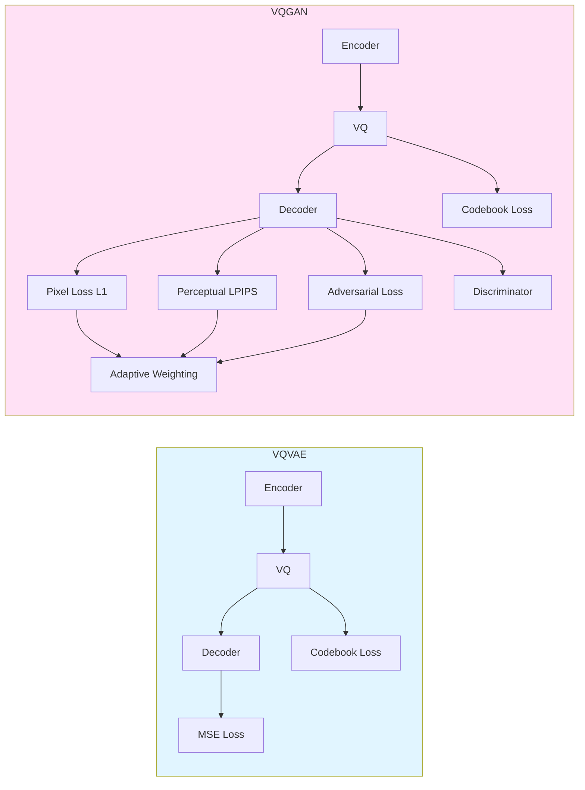
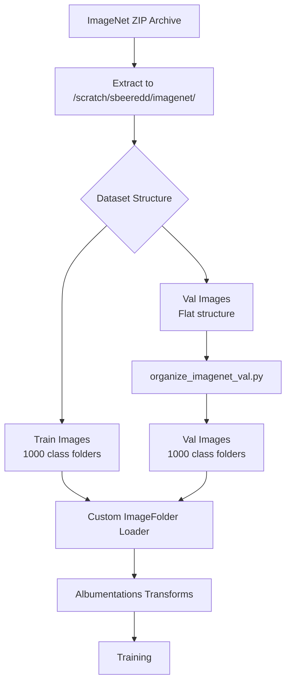
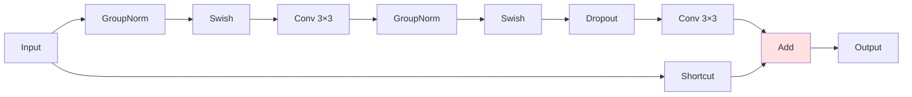
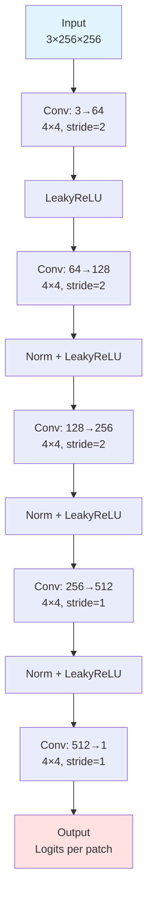
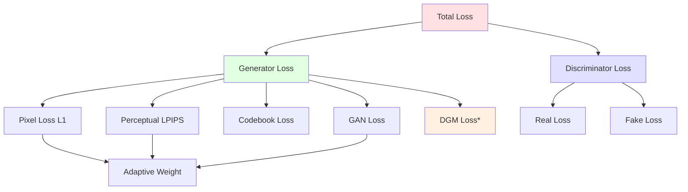
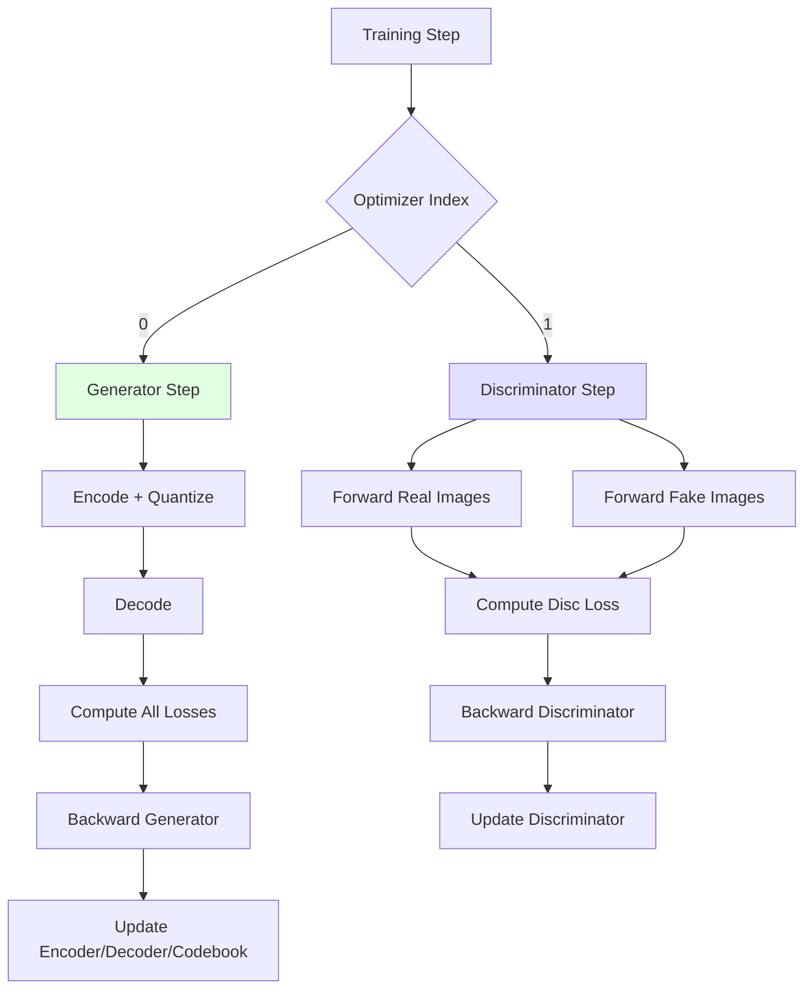
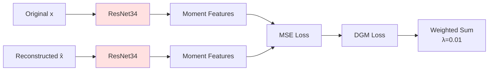
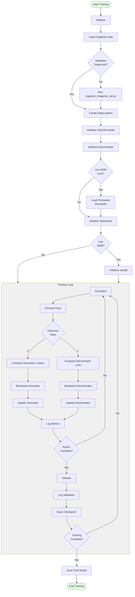

# VQGAN Complete Training Guide for ImageNet

**A Comprehensive Deep Dive into Vector Quantized Generative Adversarial Networks**

This document provides a complete, end-to-end explanation of how VQGAN training works on ImageNet, from raw dataset extraction to final model outputs, including adversarial training and perceptual losses.

---

## Table of Contents

1. [Overview](#overview)
2. [VQGAN vs VQVAE: Key Differences](#vqgan-vs-vqvae-key-differences)
3. [Dataset Processing Pipeline](#dataset-processing-pipeline)
4. [Data Loading & Preprocessing](#data-loading--preprocessing)
5. [Model Architecture](#model-architecture)
6. [Loss Functions](#loss-functions)
7. [Training Loop & Optimization](#training-loop--optimization)
8. [Deep Geometric Moments (DGM) Loss](#deep-geometric-moments-dgm-loss)
9. [Complete Training Pipeline](#complete-training-pipeline)
10. [Mathematical Foundations](#mathematical-foundations)
11. [Implementation Details](#implementation-details)

---

## Overview

### What is VQGAN?

Vector Quantized Generative Adversarial Network (VQGAN) extends VQVAE by adding:
1. **Perceptual Loss** (LPIPS): Measures perceptual similarity instead of just pixel-level MSE
2. **Adversarial Loss** (GAN): Discriminator judges if reconstructions are realistic
3. **Adaptive Loss Weighting**: Automatically balances different loss components

**Key Innovation**: Combines discrete latent representations with adversarial training for photorealistic reconstructions.

### VQGAN for ImageNet

**Dataset**: ImageNet ILSVRC 2012
- **Training Set**: 1,281,167 images across 1000 classes  
- **Validation Set**: 50,000 images across 1000 classes
- **Image Resolution**: 256×256 (processed)
- **Classes**: 1000 object categories (synsets)

**Training Modes**:
1. **IMAGENET_VAL**: Train on validation set only (50K images) - for quick experiments
2. **IMAGENET_FULL**: Train on full training set (1.28M images) - for production models

---

## VQGAN vs VQVAE: Key Differences



### Comparison Table

| Component | VQVAE | VQGAN |
|-----------|-------|-------|
| **Encoder** | Simple CNN | ResNet-based with attention |
| **Decoder** | Simple CNN | ResNet-based with attention |
| **Quantization** | Basic VQ | VQ with better codebook usage |
| **Pixel Loss** | MSE (L2) | L1 (more robust) |
| **Perceptual Loss** | None | LPIPS (VGG features) |
| **Adversarial Loss** | None | PatchGAN discriminator |
| **Loss Weighting** | Fixed | Adaptive (gradient-based) |
| **Image Quality** | Good | Photorealistic |
| **Training Time** | Fast (~14-34 hrs) | Slower (~48-96 hrs) |
| **Codebook Size** | 512 | 1024 (typical) |
| **Embedding Dim** | 64 | 256 (typical) |

---

## Dataset Processing Pipeline

### High-Level Dataset Flow



### Dataset Organization

**Use the same organization script from VQVAE**:

```bash
cd /scratch/sbeeredd/sandbox/vqvae
python organize_imagenet_val.py
```

This organizes validation images from flat structure to class folders required by the data loaders.

**Final Structure**:
```
/scratch/sbeeredd/imagenet/ILSVRC/Data/CLS-LOC/
├── train/              # 1000 class folders (organized)
│   ├── n01440764/
│   ├── n01443537/
│   └── ...
└── val/                # 1000 class folders (after organization)
    ├── n01440764/
    ├── n01443537/
    └── ...
```

---

## Data Loading & Preprocessing

### Data Loading Pipeline


### Albumentations Transforms

**Training Set**:
```python
transforms = [
    albumentations.SmallestMaxSize(max_size=256),    # Resize
    albumentations.RandomCrop(height=256, width=256), # Random crop
    albumentations.HorizontalFlip(),                  # Augmentation
]
```

**Validation Set**:
```python
transforms = [
    albumentations.SmallestMaxSize(max_size=256),    # Resize
    albumentations.CenterCrop(height=256, width=256), # Center crop
]
# No horizontal flip - deterministic
```

**Image Normalization**:
- Albumentations returns images in range `[0, 1]`
- VQGAN expects images in range `[-1, 1]`
- Normalization: `x = (x - 0.5) * 2` (implicitly handled)

### Data Loader Configuration

```python
DataLoader(
    dataset,
    batch_size=8,        # Smaller batch due to discriminator
    num_workers=8,       # Parallel loading
    shuffle=True,        # Randomize order
)
```

**Effective Batch Size**: `8 × 8 (accumulation) = 64`

---

## Model Architecture

### VQGAN Complete Architecture

```mermaid
flowchart TD
    subgraph Input
        X[Input x<br/>B×3×256×256]
    end
    
    subgraph Encoder["Encoder (ResNet-based)"]
        E1[Conv: 3→128<br/>3×3, stride=1]
        E2[ResBlock 128→128<br/>×2 blocks]
        E3[Downsample ÷2<br/>128×128]
        E4[ResBlock 128→128<br/>×2 blocks]
        E5[Downsample ÷2<br/>64×64]
        E6[ResBlock 128→256<br/>×2 blocks]
        E7[Downsample ÷2<br/>32×32]
        E8[ResBlock 256→256<br/>×2 blocks]
        E9[Downsample ÷2<br/>16×16]
        E10[Attention<br/>@16×16]
        E11[ResBlock 256→512<br/>×2 blocks]
    end
    
    subgraph PreQuant
        PQ[Conv: 512→256<br/>1×1]
    end
    
    subgraph VectorQuantizer
        VQ1[Flatten]
        VQ2[Compute Distances]
        VQ3[Find Nearest Code]
        VQ4[Quantize]
    end
    
    subgraph Codebook
        CB[1024 embeddings<br/>256-dim each]
    end
    
    subgraph PostQuant
        PPQ[Conv: 256→512<br/>1×1]
    end
    
    subgraph Decoder["Decoder (ResNet-based)"]
        D1[ResBlock 512→512<br/>×2 blocks]
        D2[Attention<br/>@16×16]
        D3[Upsample ×2<br/>32×32]
        D4[ResBlock 512→256<br/>×2 blocks]
        D5[Upsample ×2<br/>64×64]
        D6[ResBlock 256→256<br/>×2 blocks]
        D7[Upsample ×2<br/>128×128]
        D8[ResBlock 256→128<br/>×2 blocks]
        D9[Upsample ×2<br/>256×256]
        D10[ResBlock 128→128<br/>×2 blocks]
        D11[Conv: 128→3<br/>3×3]
    end
    
    subgraph Output
        XHAT[Reconstruction<br/>B×3×256×256]
    end
    
    X --> E1 --> E2 --> E3 --> E4 --> E5 --> E6 --> E7 --> E8 --> E9 --> E10 --> E11
    E11 --> PQ --> VQ1 --> VQ2
    CB -.-> VQ2
    VQ2 --> VQ3 --> VQ4
    VQ4 --> PPQ --> D1 --> D2 --> D3 --> D4 --> D5 --> D6 --> D7 --> D8 --> D9 --> D10 --> D11
    D11 --> XHAT
    
    style X fill:#e1f5ff
    style XHAT fill:#e1f5ff
    style VectorQuantizer fill:#ffe1e1
    style Codebook fill:#ffe1e1
```

### Detailed Component Breakdown

#### 1. Encoder Architecture

**Purpose**: Compress input to compact latent representation with rich features

**Key Features**:
- **ResNet Blocks**: Better gradient flow than simple convolutions
- **Attention Mechanism**: Captures long-range dependencies at 16×16 resolution
- **Progressive Downsampling**: 4× reduction (256→64 per dimension), 16× area reduction
- **Channel Expansion**: 3 channels → 512 channels

**Architecture**:
```
Input: [B, 3, 256, 256]

Initial Conv: 3→128, kernel=3×3, stride=1, padding=1
              [B, 128, 256, 256]

Down Block 1:
    ResBlock ×2: 128→128
    Downsample: ÷2
    [B, 128, 128, 128]

Down Block 2:
    ResBlock ×2: 128→128
    Downsample: ÷2
    [B, 128, 64, 64]

Down Block 3:
    ResBlock ×2: 128→256
    Downsample: ÷2
    [B, 256, 32, 32]

Down Block 4:
    ResBlock ×2: 256→256
    Downsample: ÷2
    Attention: Self-attention at this resolution
    ResBlock ×2: 256→512
    [B, 512, 16, 16]

Output: [B, 512, 16, 16]
```

**Spatial Reduction**: 256×256 → 16×16 (16× compression)

#### 2. ResNet Block Detail



**Advantages over Simple Conv**:
- Skip connections prevent vanishing gradients
- GroupNorm for stable training (better than BatchNorm for small batches)
- Swish activation (smooth, better than ReLU)
- Optional dropout for regularization

#### 3. Self-Attention Mechanism

**Purpose**: Capture global dependencies across the feature map

```python
class AttnBlock:
    def forward(self, x):
        # x: [B, C, H, W]
        B, C, H, W = x.shape
        
        # Compute Q, K, V
        q = self.q_conv(x).view(B, C, H*W)  # [B, C, HW]
        k = self.k_conv(x).view(B, C, H*W)  # [B, C, HW]
        v = self.v_conv(x).view(B, C, H*W)  # [B, C, HW]
        
        # Attention scores
        attn = torch.bmm(q.transpose(1, 2), k)  # [B, HW, HW]
        attn = attn * (C ** -0.5)  # Scale
        attn = F.softmax(attn, dim=2)  # Normalize
        
        # Apply attention
        out = torch.bmm(v, attn.transpose(1, 2))  # [B, C, HW]
        out = out.view(B, C, H, W)  # Reshape
        
        return x + out  # Residual connection
```

**Computational Cost**: O((H×W)²) - expensive, so only used at low resolution (16×16)

#### 4. Vector Quantizer

**Same as VQVAE** but with larger codebook:
- Codebook size: 1024 (vs 512 in VQVAE)
- Embedding dim: 256 (vs 64 in VQVAE)
- Commitment cost β: 0.25

**Process**:
1. Pre-quant conv: 512→256 channels
2. Flatten: [B, 256, 16, 16] → [B×256, 256]
3. Find nearest of 1024 codes
4. Replace with codebook vectors
5. Straight-through estimator for gradients

#### 5. Decoder Architecture

**Purpose**: Reconstruct high-quality image from discrete codes

**Key Features**:
- **Symmetric to Encoder**: Mirror architecture
- **Progressive Upsampling**: 4× expansion (16→256 per dimension)
- **Attention**: Same position as encoder (16×16)
- **Channel Reduction**: 512 channels → 3 channels (RGB)

**Architecture**:
```
Input: [B, 256, 16, 16] (after post-quant conv 256→512)

Up Block 1:
    ResBlock ×2: 512→512
    Attention: Self-attention
    Upsample: ×2
    [B, 512, 32, 32]

Up Block 2:
    ResBlock ×2: 512→256
    Upsample: ×2
    [B, 256, 64, 64]

Up Block 3:
    ResBlock ×2: 256→256
    Upsample: ×2
    [B, 256, 128, 128]

Up Block 4:
    ResBlock ×2: 256→128
    Upsample: ×2
    [B, 128, 256, 256]

Final:
    ResBlock ×2: 128→128
    Conv: 128→3, kernel=3×3
    [B, 3, 256, 256]

Output: [B, 3, 256, 256]
```

### Discriminator Architecture (PatchGAN)

**Purpose**: Judge whether image patches are real or fake



**Key Features**:
- **PatchGAN**: Outputs decision for each patch, not whole image
- **Receptive Field**: Each output neuron sees 70×70 patch
- **LeakyReLU**: Prevents dying neurons (α=0.2)
- **No Sigmoid**: Outputs raw logits (used with hinge loss)

**Output Shape**: [B, 1, 30, 30] - Decision for each 30×30 grid location

---

## Loss Functions

### VQGAN Loss Components



### 1. Pixel Reconstruction Loss (L1)

**Purpose**: Basic pixel-level similarity

```python
pixel_loss = torch.abs(x - x_hat).mean()
```

**Why L1 instead of L2 (MSE)?**
- More robust to outliers
- Better preserves sharp edges
- Less blurry reconstructions

### 2. Perceptual Loss (LPIPS)

**Purpose**: Measure perceptual similarity using deep features

**LPIPS (Learned Perceptual Image Patch Similarity)**:
- Uses pretrained VGG network
- Extracts features at multiple layers
- Compares feature distances instead of pixels

```python
# Simplified LPIPS
vgg = VGG16(pretrained=True).eval()

# Extract features at multiple layers
feats_x = vgg.extract_features(x)      # List of feature maps
feats_xhat = vgg.extract_features(x_hat)

# Compute weighted distance
lpips_loss = 0
for feat_x, feat_xhat, weight in zip(feats_x, feats_xhat, weights):
    lpips_loss += weight * F.mse_loss(feat_x, feat_xhat)
```

**Advantages**:
- Aligns with human perception
- Better captures semantic similarity
- Prevents unnatural reconstructions

### 3. Codebook Loss

**Same as VQVAE**:
```python
codebook_loss = ||sg[z_e] - e||² + β·||z_e - sg[e]||²
```

where:
- `z_e`: Encoder output (continuous)
- `e`: Codebook embedding (discrete)
- `sg[]`: Stop gradient
- `β = 0.25`: Commitment cost

### 4. Adversarial Loss (GAN)

**Generator Loss** (fool the discriminator):
```python
logits_fake = discriminator(x_hat)
g_loss = -torch.mean(logits_fake)  # Want high scores
```

**Discriminator Loss** (distinguish real from fake):
```python
logits_real = discriminator(x)
logits_fake = discriminator(x_hat.detach())

# Hinge loss
d_loss_real = torch.mean(F.relu(1.0 - logits_real))
d_loss_fake = torch.mean(F.relu(1.0 + logits_fake))
d_loss = 0.5 * (d_loss_real + d_loss_fake)
```

**Hinge Loss** vs **Vanilla GAN Loss**:
- Hinge: More stable training, used by default
- Vanilla: Uses softplus, alternative option

### 5. Adaptive Weight Calculation

**Problem**: Different loss scales make weighting hard

**Solution**: Adaptive weighting based on gradients

```python
def calculate_adaptive_weight(nll_loss, g_loss, last_layer):
    # Compute gradients w.r.t. last decoder layer
    nll_grads = torch.autograd.grad(nll_loss, last_layer, 
                                     retain_graph=True)[0]
    g_grads = torch.autograd.grad(g_loss, last_layer, 
                                   retain_graph=True)[0]
    
    # Ratio of gradient norms
    d_weight = torch.norm(nll_grads) / (torch.norm(g_grads) + 1e-4)
    d_weight = torch.clamp(d_weight, 0.0, 1e4)
    
    return d_weight
```

**Intuition**: 
- If GAN gradients are large, reduce GAN weight
- If reconstruction gradients are large, increase GAN weight
- Keeps losses balanced throughout training

### 6. Deep Geometric Moments (DGM) Loss

**Optional auxiliary loss** (same as VQVAE):

```python
if dgm_weight > 0:
    # Extract features
    with torch.no_grad():
        _, moments_x = dgm_model(x)
    _, moments_xhat = dgm_model(x_hat)
    
    # MSE on moment representations
    dgm_loss = torch.mean((moments_x - moments_xhat) ** 2)
    
    total_loss += dgm_weight * dgm_loss
```

**Configuration**:
- ResNet34 pretrained on ImageNet
- Input size: 256×256
- Weight: 0.01

### Complete Loss Formulation

**Generator Loss**:
```python
total_loss = pixel_weight * pixel_loss +
             perceptual_weight * lpips_loss +
             adaptive_weight * disc_factor * g_loss +
             codebook_weight * codebook_loss +
             dgm_weight * dgm_loss  # Optional
```

**Default Weights**:
- `pixel_weight = 1.0`
- `perceptual_weight = 1.0`
- `disc_weight = 0.8` (before adaptive weighting)
- `codebook_weight = 1.0`
- `dgm_weight = 0.01` (optional)
- `disc_factor`: 0 before `disc_start` (30K steps), then 1.0

---

## Training Loop & Optimization

### Dual Optimizer Setup



### Training Algorithm

```python
def training_step(batch, batch_idx, optimizer_idx):
    x = get_input(batch)  # [B, 3, 256, 256]
    
    # Forward pass
    z_e = encoder(x)                    # [B, 512, 16, 16]
    z_e = pre_quant_conv(z_e)           # [B, 256, 16, 16]
    z_q, codebook_loss, _ = quantize(z_e)  # Quantize
    z_q = post_quant_conv(z_q)          # [B, 512, 16, 16]
    x_hat = decoder(z_q)                # [B, 3, 256, 256]
    
    if optimizer_idx == 0:  # Generator
        # Reconstruction losses
        pixel_loss = torch.abs(x - x_hat).mean()
        perceptual_loss = lpips(x, x_hat)
        nll_loss = pixel_loss + perceptual_weight * perceptual_loss
        
        # GAN loss
        logits_fake = discriminator(x_hat)
        g_loss = -torch.mean(logits_fake)
        
        # Adaptive weighting
        d_weight = calculate_adaptive_weight(nll_loss, g_loss, 
                                             decoder.last_layer)
        
        # Discriminator warmup
        disc_factor = 0 if global_step < disc_start else 1
        
        # Total generator loss
        loss = (nll_loss + 
                d_weight * disc_factor * g_loss +
                codebook_weight * codebook_loss)
        
        # Add DGM loss (optional)
        if dgm_weight > 0:
            dgm_loss = compute_dgm_loss(x, x_hat, dgm_model)
            loss += dgm_weight * dgm_loss
        
        return loss
    
    elif optimizer_idx == 1:  # Discriminator
        # Real images
        logits_real = discriminator(x.detach())
        
        # Fake images (detached from generator)
        logits_fake = discriminator(x_hat.detach())
        
        # Hinge loss
        d_loss_real = torch.mean(F.relu(1.0 - logits_real))
        d_loss_fake = torch.mean(F.relu(1.0 + logits_fake))
        
        disc_factor = 0 if global_step < disc_start else 1
        d_loss = disc_factor * 0.5 * (d_loss_real + d_loss_fake)
        
        return d_loss
```

### Optimizer Configuration

```python
# Generator optimizer (encoder + decoder + quantizer)
opt_generator = torch.optim.Adam(
    list(encoder.parameters()) +
    list(decoder.parameters()) +
    list(quantizer.parameters()) +
    list(pre_quant_conv.parameters()) +
    list(post_quant_conv.parameters()),
    lr=learning_rate,
    betas=(0.5, 0.9)  # β1=0.5 for GAN stability
)

# Discriminator optimizer
opt_discriminator = torch.optim.Adam(
    discriminator.parameters(),
    lr=learning_rate,
    betas=(0.5, 0.9)
)
```

**Learning Rate Calculation**:
```python
base_lr = 4.5e-6
batch_size = 8
accumulate_grad_batches = 8
num_gpus = 1

learning_rate = accumulate_grad_batches * num_gpus * batch_size * base_lr
              = 8 * 1 * 8 * 4.5e-6
              = 2.88e-4
```

### Training Schedule

**Discriminator Warmup**:
- First 30,000 steps: Train only reconstruction (no discriminator)
- After 30,000 steps: Enable discriminator

**Why warmup?**
- Gives generator head start
- Prevents discriminator from being too strong early
- More stable training

**Training Steps**:
- ImageNet Val: ~78K steps/epoch × 100 epochs = 7.8M steps
- ImageNet Full: ~20K steps/epoch × 100 epochs = 2M steps

---

## Deep Geometric Moments (DGM) Loss

### DGM Integration in VQGAN

**Same concept as VQVAE**, but integrated into the multi-loss framework:



### DGM Configuration

**For ImageNet**:
```yaml
dgm_weight: 0.01
dgm_loss_type: 'mse'
dgm_model_path: '/scratch/.../res34_model_best.pth.tar'
dgm_num_classes: 1000
dgm_hw: 256
dgm_model_type: 'imagenet'
dgm_arch: 'resnet34'
```

### Benefits in VQGAN Context

1. **Semantic Consistency**: Complements perceptual loss
2. **Spatial Structure**: Preserves geometric relationships
3. **Regularization**: Prevents adversarial artifacts
4. **Better Codebook**: Encourages semantically meaningful codes

---

## Complete Training Pipeline

### End-to-End Training Flow



### Detailed Training Pseudocode

```python
def train():
    # ===== INITIALIZATION =====
    # 1. Load data
    data_module = DataModuleFromConfig(
        batch_size=8,
        num_workers=8,
        train=ImageNetValCustomTrain(...),
        validation=ImageNetValCustomValidation(...)
    )
    
    # 2. Initialize model
    model = VQModel(
        ddconfig={...},  # Encoder/decoder config
        lossconfig={...},  # Loss configuration
        n_embed=1024,
        embed_dim=256
    )
    
    # 3. Load DGM model (optional)
    if dgm_weight > 0:
        dgm_model = load_dgm_model(...)
    
    # 4. Initialize trainer with callbacks
    trainer = Trainer(
        max_epochs=100,
        accumulate_grad_batches=8,
        gradient_clip_val=1.0,
        logger=WandbLogger(...),
        callbacks=[ImageLogger(...), ModelCheckpoint(...)]
    )
    
    # ===== TRAINING LOOP =====
    for epoch in range(max_epochs):
        for batch_idx, batch in enumerate(train_loader):
            x = batch['image']  # [B, 3, 256, 256]
            
            # === Generator Step (optimizer_idx=0) ===
            z_e = model.encoder(x)
            z_e = model.quant_conv(z_e)
            z_q, codebook_loss, info = model.quantize(z_e)
            z_q = model.post_quant_conv(z_q)
            x_hat = model.decoder(z_q)
            
            # Compute losses
            pixel_loss = torch.abs(x - x_hat).mean()
            lpips_loss = model.loss.perceptual_loss(x, x_hat)
            nll_loss = pixel_loss + lpips_loss
            
            logits_fake = model.loss.discriminator(x_hat)
            g_loss = -torch.mean(logits_fake)
            
            d_weight = calculate_adaptive_weight(nll_loss, g_loss)
            disc_factor = 0 if global_step < 30000 else 1
            
            gen_loss = (nll_loss + 
                       d_weight * disc_factor * g_loss +
                       codebook_loss)
            
            if dgm_weight > 0:
                dgm_loss = compute_dgm_loss(x, x_hat, dgm_model)
                gen_loss += dgm_weight * dgm_loss
            
            # Backward and update
            opt_generator.zero_grad()
            gen_loss.backward()
            torch.nn.utils.clip_grad_norm_(generator_params, 1.0)
            opt_generator.step()
            
            # === Discriminator Step (optimizer_idx=1) ===
            logits_real = model.loss.discriminator(x)
            logits_fake = model.loss.discriminator(x_hat.detach())
            
            d_loss_real = torch.mean(F.relu(1.0 - logits_real))
            d_loss_fake = torch.mean(F.relu(1.0 + logits_fake))
            disc_loss = disc_factor * 0.5 * (d_loss_real + d_loss_fake)
            
            opt_discriminator.zero_grad()
            disc_loss.backward()
            opt_discriminator.step()
            
            # Log metrics
            if use_wandb:
                wandb.log({
                    'train/total_loss': gen_loss,
                    'train/rec_loss': pixel_loss,
                    'train/perceptual_loss': lpips_loss,
                    'train/codebook_loss': codebook_loss,
                    'train/g_loss': g_loss,
                    'train/disc_loss': disc_loss,
                    'train/perplexity': info[0],
                    'train/dgm_loss': dgm_loss if dgm_weight > 0 else 0,
                })
        
        # Validation
        validate(model, val_loader)
        
        # Save checkpoint
        save_checkpoint(model, epoch)
```

### Logged Metrics

**Training (every step)**:
- `train/total_loss`: Combined generator loss
- `train/rec_loss`: Pixel reconstruction (L1)
- `train/perceptual_loss`: LPIPS loss
- `train/codebook_loss`: VQ loss
- `train/g_loss`: Adversarial generator loss
- `train/disc_loss`: Discriminator loss
- `train/perplexity`: Codebook usage
- `train/dgm_loss`: DGM auxiliary loss (if enabled)
- `train/d_weight`: Adaptive weight value

**Validation (every epoch)**:
- Same metrics as training
- `val/inputs`: Sample input images
- `val/reconstructions`: Sample reconstructions

### Typical Training Curves

**Expected Behavior**:
1. **Reconstruction Loss**: Decreases from ~0.5 to ~0.05-0.1
2. **Perceptual Loss**: Decreases from ~0.3 to ~0.02-0.05
3. **Discriminator Loss**: Fluctuates around 0.5-1.0 (balanced)
4. **Generator Loss**: Increases initially (disc gets stronger), then stabilizes
5. **Perplexity**: Increases from ~10-50 to ~300-600 (out of 1024)

**Warning Signs**:
- **Mode Collapse**: Perplexity < 50
- **Discriminator Dominance**: Disc loss → 0, Gen loss → ∞
- **Generator Dominance**: Disc loss → ∞, Gen loss → 0
- **Poor Reconstructions**: High LPIPS despite low L1

---

## Mathematical Foundations

### VQGAN Objective Function

**Complete objective**:
```
L_total = L_rec + λ_perceptual·L_LPIPS + λ_adaptive·λ_disc·L_GAN + λ_codebook·L_VQ + λ_dgm·L_DGM

where:
L_rec = |x - x̂|₁
L_LPIPS = Σᵢ wᵢ||φᵢ(x) - φᵢ(x̂)||²
L_GAN = -𝔼[D(x̂)]  (generator)
L_GAN = 𝔼[max(0, 1-D(x))] + 𝔼[max(0, 1+D(x̂))]  (discriminator)
L_VQ = ||sg[z_e] - e||² + β·||z_e - sg[e]||²
L_DGM = ||M(x) - M(x̂)||²  (optional)
```

**Notation**:
- `x`: Original image
- `x̂`: Reconstruction
- `D(·)`: Discriminator
- `φᵢ(·)`: VGG features at layer i
- `M(·)`: DGM moment extraction
- `sg[·]`: Stop gradient
- `λ_adaptive`: Adaptive weight (gradient-based)
- `λ_disc`: Discriminator factor (0 or 1)

### Adaptive Weight Derivation

**Goal**: Balance reconstruction and adversarial losses

**Method**: Match gradient magnitudes

```
∇θ_last L_rec ≈ λ_adaptive · ∇θ_last L_GAN

λ_adaptive = ||∇θ_last L_rec|| / ||∇θ_last L_GAN||
```

**Clamping**: `λ_adaptive ∈ [0, 10000]` for numerical stability

### Perplexity Calculation

**Same as VQVAE**:
```
Perplexity = exp(H)
H = -Σ p_k log(p_k)

where:
p_k = (1/N) Σᵢ 𝟙[argmin_j ||z_i - e_j|| = k]
```

**Interpretation**: Effective number of codebook entries used

---

## Implementation Details

### Memory Requirements

**Model Parameters**:
- Encoder: ~45M
- Decoder: ~45M
- Quantizer: 1024 × 256 = 256K
- Discriminator: ~3M
- **Total**: ~93M parameters

**Activation Memory** (batch_size=8):
- Input: 8 × 3 × 256 × 256 × 4 = 6 MB
- Encoder output: 8 × 512 × 16 × 16 × 4 = 2 MB
- Decoder intermediate: ~10 MB
- Discriminator: ~5 MB
- Gradients (2×): ~40 MB
- **Total**: ~70-100 MB per batch

**Recommended GPU**: 16GB+ VRAM for batch_size=8

### Computational Complexity

**Forward Pass**:
- Encoder: O(B × C × H × W) convolutions
- Attention: O(B × C × (H/16 × W/16)²) - expensive
- Quantization: O(B × H/16 × W/16 × K × D) distances
- Decoder: O(B × C × H × W) convolutions
- Discriminator: O(B × C × H × W) convolutions
- LPIPS: O(B × C × H × W) × 5 layers

**Per Step Time**: ~1.5-2.0s on V100 (including both optimizers)

### Training Time Estimates

**ImageNet Val (50K images, 100 epochs)**:
- Steps per epoch: 50,000 / 8 / 8 ≈ 781 steps
- Total steps: 781 × 100 = 78,100
- Time per step: ~1.75s
- **Total time**: ~38 hours on single V100

**ImageNet Full (1.28M images, 100 epochs)**:
- Steps per epoch: 1,280,000 / 8 / 8 = 20,000 steps
- Total steps: 20,000 × 100 = 2M
- Time per step: ~1.75s
- **Total time**: ~972 hours = 40.5 days on single V100
- **With 4 GPUs**: ~10 days

### Checkpointing Strategy

**Save every N epochs**:
```python
ModelCheckpoint(
    dirpath='logs/checkpoints',
    filename='{epoch:06}',
    save_top_k=3,  # Keep best 3 checkpoints
    monitor='val/rec_loss',  # Track reconstruction loss
    save_last=True  # Always save last
)
```

**Checkpoint Contents**:
```python
{
    'state_dict': {
        'encoder': ...,
        'decoder': ...,
        'quantize': ...,
        'loss.discriminator': ...,
    },
    'optimizer_states': [...],
    'lr_schedulers': [...],
    'epoch': current_epoch,
    'global_step': global_step,
}
```

---

## Summary

### Key Takeaways

1. **Dataset Processing**:
   - Same as VQVAE: use `organize_imagenet_val.py`
   - Custom data loaders with Albumentations
   - Images normalized to [-1, 1]

2. **Architecture**:
   - ResNet-based encoder/decoder (deeper than VQVAE)
   - Self-attention at 16×16 resolution
   - 1024 codes × 256 dimensions
   - PatchGAN discriminator (3 layers)

3. **Loss Functions**:
   - L1 pixel loss (more robust than L2)
   - LPIPS perceptual loss (VGG features)
   - Adversarial loss (hinge or vanilla)
   - VQ codebook loss (same as VQVAE)
   - DGM auxiliary loss (optional)
   - Adaptive weighting (gradient-based)

4. **Training**:
   - Dual optimization (generator + discriminator)
   - Discriminator warmup (30K steps)
   - Gradient accumulation (8 batches)
   - Gradient clipping (max_norm=1.0)
   - ~38 hours for Val, ~40 days for Full (single GPU)

5. **Improvements over VQVAE**:
   - **Better reconstructions**: LPIPS + adversarial
   - **More photorealistic**: Discriminator judges realism
   - **Larger codebook**: 1024 vs 512 codes
   - **Richer features**: 256 vs 64 dimensions
   - **Attention mechanism**: Captures global context

### Running Training

**Quick Start**:
```bash
# 1. Organize dataset (one-time, same as VQVAE)
cd /scratch/sbeeredd/sandbox/vqvae
python organize_imagenet_val.py

# 2. Train baseline
cd /scratch/sbeeredd/sandbox/taming-transformers
bash train_imagenet_val_baseline.sh

# 3. Train with DGM
bash train_imagenet_val_dgm.sh
```

**Monitor Progress**:
- Weights & Biases dashboard
- TensorBoard logs
- Image reconstructions every 750 steps
- Metrics logged every step

**Expected Results**:
- Reconstruction loss (L1): ~0.05-0.1
- Perceptual loss (LPIPS): ~0.02-0.05
- Perplexity: ~300-600 (out of 1024)
- Visual quality: Photorealistic, sharp details

---

## References

1. **VQGAN Paper**: [Taming Transformers for High-Resolution Image Synthesis](https://arxiv.org/abs/2012.09841)
2. **VQVAE Paper**: [Neural Discrete Representation Learning](https://arxiv.org/abs/1711.00937)
3. **LPIPS Paper**: [The Unreasonable Effectiveness of Deep Features as a Perceptual Metric](https://arxiv.org/abs/1801.03924)
4. **ImageNet**: [ImageNet Large Scale Visual Recognition Challenge](https://arxiv.org/abs/1409.0575)
5. **PatchGAN**: [Image-to-Image Translation with Conditional Adversarial Networks](https://arxiv.org/abs/1611.07004)

---

**Document Version**: 1.0  
**Last Updated**: November 27, 2025  
**Author**: VQGAN Training Documentation
