# VQVAE Complete Training Guide for ImageNet

**A Comprehensive Deep Dive into Vector Quantized Variational Autoencoders**

This document provides a complete, end-to-end explanation of how VQVAE training works on ImageNet, from raw dataset extraction to final model outputs.

---

## Table of Contents

1. [Overview](#overview)
2. [Dataset Processing Pipeline](#dataset-processing-pipeline)
3. [Data Loading & Preprocessing](#data-loading--preprocessing)
4. [Model Architecture](#model-architecture)
5. [Training Loop & Loss Computation](#training-loop--loss-computation)
6. [Deep Geometric Moments (DGM) Loss](#deep-geometric-moments-dgm-loss)
7. [Complete Training Pipeline](#complete-training-pipeline)
8. [Mathematical Foundations](#mathematical-foundations)
9. [Implementation Details](#implementation-details)

---

## Overview

### What is VQVAE?

Vector Quantized Variational Autoencoder (VQVAE) is a generative model that learns discrete latent representations of images. Unlike traditional VAEs that use continuous latent spaces, VQVAE uses a discrete codebook of embeddings.

**Key Innovation**: Maps continuous encoder outputs to discrete codes via vector quantization, enabling:
- Discrete latent representations (like tokens)
- Better reconstruction quality
- Autoregressive modeling with PixelCNN
- Compatibility with language modeling techniques

### VQVAE for ImageNet

**Dataset**: ImageNet ILSVRC 2012
- **Training Set**: 1,281,167 images across 1000 classes
- **Validation Set**: 50,000 images across 1000 classes
- **Image Resolution**: Variable (resized to 256×256)
- **Classes**: 1000 object categories (synsets)

**Training Modes**:
1. **IMAGENET_VAL**: Train on validation set only (50K images) - for quick experiments
2. **IMAGENET_FULL**: Train on full training set (1.28M images) - for production models

---

## Dataset Processing Pipeline

### High-Level Dataset Flow

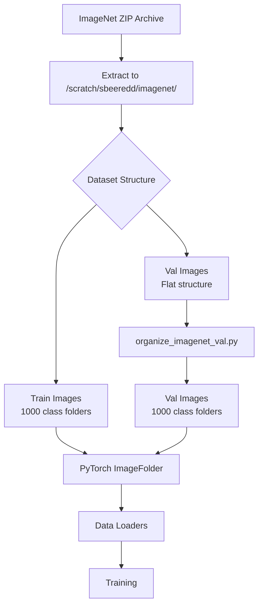

### Step 1: Dataset Extraction

**Location**: `/scratch/sbeeredd/imagenet/`

**Initial Structure**:
```
imagenet/
├── ILSVRC/
│   ├── Data/CLS-LOC/
│   │   ├── train/              # Already organized
│   │   │   ├── n01440764/      # Class: tench fish
│   │   │   │   ├── n01440764_*.JPEG
│   │   │   ├── n01443537/      # Class: goldfish
│   │   │   └── ... (1000 classes)
│   │   └── val/                # Flat structure - NEEDS ORGANIZATION
│   │       ├── ILSVRC2012_val_00000001.JPEG
│   │       ├── ILSVRC2012_val_00000002.JPEG
│   │       └── ... (50,000 images)
├── LOC_synset_mapping.txt      # Class ID to name mapping
└── LOC_val_solution.csv        # Validation labels
```

### Step 2: Validation Set Organization

**Problem**: Validation images are in a flat directory, but PyTorch's `ImageFolder` expects class-organized structure.

**Solution**: Run `organize_imagenet_val.py`

#### Organization Algorithm

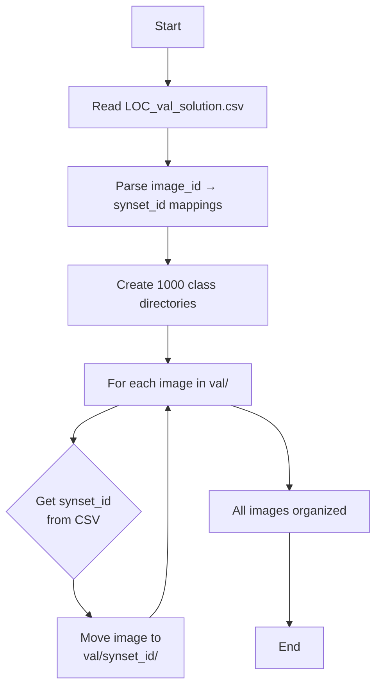

#### Detailed Process

1. **Read Solution File** (`LOC_val_solution.csv`):
   ```csv
   ImageId,PredictionString
   ILSVRC2012_val_00048981,n03995372 85 1 499 272
   ILSVRC2012_val_00037956,n03481172 131 0 499 254
   ```
   - Column 1: Image ID (filename without .JPEG)
   - Column 2: Synset ID + bounding box (we only need synset ID)

2. **Extract Synset Mapping**:
   ```python
   image_to_class = {
       'ILSVRC2012_val_00048981': 'n03995372',
       'ILSVRC2012_val_00037956': 'n03481172',
       ...
   }
   ```

3. **Create Class Directories**:
   ```bash
   mkdir val/n01440764
   mkdir val/n01443537
   ... (1000 directories)
   ```

4. **Move Images**:
   ```bash
   mv val/ILSVRC2012_val_00048981.JPEG val/n03995372/
   mv val/ILSVRC2012_val_00037956.JPEG val/n03481172/
   ```

**Result**:
```
val/
├── n01440764/
│   ├── ILSVRC2012_val_00012345.JPEG
│   ├── ILSVRC2012_val_00023456.JPEG
│   └── ... (~50 images per class)
├── n01443537/
└── ... (1000 class folders)
```

### Step 3: Class Mapping

**Synset to Class Name** (`LOC_synset_mapping.txt`):
```
n01440764 tench, Tinca tinca
n01443537 goldfish, Carassius auratus
n01484850 great white shark, white shark, man-eater
...
```

PyTorch automatically assigns integer labels 0-999 based on alphabetical folder order:
- `n01440764` → Label 0
- `n01443537` → Label 1
- etc.

---

## Data Loading & Preprocessing

### PyTorch ImageFolder Pipeline

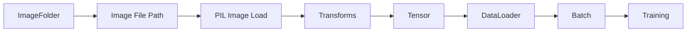

### Data Loading Code Flow

```python
# From utils.py - load_imagenet_full()
train = datasets.ImageFolder(
    root='/scratch/sbeeredd/imagenet/ILSVRC/Data/CLS-LOC/train',
    transform=train_transforms
)
val = datasets.ImageFolder(
    root='/scratch/sbeeredd/imagenet/ILSVRC/Data/CLS-LOC/val',
    transform=val_transforms
)
```

**ImageFolder Behavior**:
1. Scans directory for subdirectories (each = 1 class)
2. Enumerates all images in each subdirectory
3. Assigns labels based on sorted folder names
4. Returns `(image, label)` tuples

### Preprocessing Transforms

#### Training Set Transforms
```python
train_transforms = transforms.Compose([
    transforms.Resize(256),              # Resize shortest side to 256
    transforms.CenterCrop(256),          # Crop to 256×256
    transforms.RandomHorizontalFlip(),   # Data augmentation
    transforms.ToTensor(),               # Convert to [0,1] tensor
    transforms.Normalize(                # Normalize to [-1, 1]
        (0.5, 0.5, 0.5), 
        (0.5, 0.5, 0.5)
    )
])
```

**Step-by-step transformation**:

```mermaid
flowchart LR
    A[JPEG File<br/>Variable Size] --> B[Resize<br/>e.g., 300×400 → 256×341]
    B --> C[CenterCrop<br/>256×341 → 256×256]
    C --> D[RandomFlip<br/>50% chance]
    D --> E[ToTensor<br/>[H,W,C] → [C,H,W]]
    E --> F[Normalize<br/>[0,1] → [-1,1]]
    F --> G[Final Tensor<br/>Shape: [3, 256, 256]<br/>Range: [-1, 1]]
```

#### Validation Set Transforms
```python
val_transforms = transforms.Compose([
    transforms.Resize(256),
    transforms.CenterCrop(256),
    transforms.ToTensor(),
    transforms.Normalize((0.5, 0.5, 0.5), (0.5, 0.5, 0.5))
])
# No RandomHorizontalFlip - deterministic for evaluation
```

### Normalization Mathematics

**Original pixel values**: `[0, 255]` (uint8)

**After ToTensor**: `[0, 1]` (float32)
```
pixel_tensor = pixel_uint8 / 255.0
```

**After Normalize**: `[-1, 1]` (float32)
```
normalized = (pixel_tensor - 0.5) / 0.5
           = (pixel_tensor - 0.5) * 2
           = 2 * pixel_tensor - 1
```

Example:
- Input: `pixel = 128` (middle gray)
- ToTensor: `128/255 ≈ 0.502`
- Normalize: `(0.502 - 0.5) / 0.5 = 0.004` ≈ 0

### DataLoader Configuration

```python
train_loader = DataLoader(
    training_data,
    batch_size=256,      # 256 images per batch
    shuffle=True,        # Randomize order each epoch
    pin_memory=True      # Faster GPU transfer
)
```

**Batch Shape**: `[256, 3, 256, 256]`
- 256 images
- 3 channels (RGB)
- 256×256 resolution

---

## Model Architecture

### VQVAE Architecture Overview

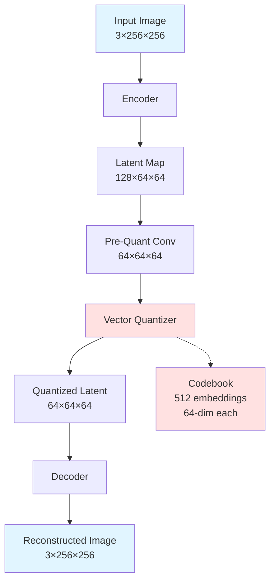

### Complete Architecture Diagram

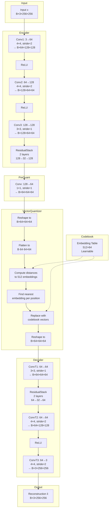

### Detailed Component Breakdown

#### 1. Encoder Architecture

**Purpose**: Compress input image to compact latent representation

**Architecture**:
```
Input: [B, 3, 256, 256]

Conv1:  3 → 64 channels, kernel=4×4, stride=2, padding=1
        Output: [B, 64, 128, 128]
ReLU

Conv2:  64 → 128 channels, kernel=4×4, stride=2, padding=1
        Output: [B, 128, 64, 64]
ReLU

Conv3:  128 → 128 channels, kernel=3×3, stride=1, padding=1
        Output: [B, 128, 64, 64]

ResidualStack (2 layers):
    Layer 1:
        ReLU → Conv(128→32, 3×3) → ReLU → Conv(32→128, 1×1) → Add
    Layer 2:
        ReLU → Conv(128→32, 3×3) → ReLU → Conv(32→128, 1×1) → Add
    Final ReLU
    
Output: [B, 128, 64, 64]
```

**Spatial Reduction**:
- Input: 256×256
- After Conv1: 128×128 (÷2)
- After Conv2: 64×64 (÷2)
- **Total reduction**: 4× in each dimension, 16× in area

**Feature Expansion**:
- Input: 3 channels (RGB)
- Output: 128 channels (rich feature representation)

#### 2. Pre-Quantization Convolution

**Purpose**: Map encoder features to quantization space

```
Input:  [B, 128, 64, 64]
Conv:   128 → 64 channels, kernel=1×1, stride=1
Output: [B, 64, 64, 64]
```

This projects the 128-dimensional encoder features to 64 dimensions to match the codebook embedding dimension.

#### 3. Vector Quantizer - The Heart of VQVAE

**Purpose**: Discretize continuous latent space using a learned codebook

##### Quantization Process

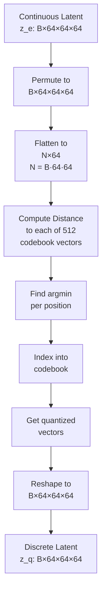

##### Mathematical Details

**Inputs**:
- Continuous latent: `z_e` with shape `[B, 64, 64, 64]`
- Codebook: `e_j` with 512 embeddings, each 64-dim

**Step 1: Reshape**
```python
z = z_e.permute(0, 2, 3, 1)  # [B, 64, 64, 64] → [B, 64, 64, 64]
z_flat = z.view(-1, 64)       # [B·64·64, 64] = [N, 64]
```

**Step 2: Compute Distances**

For each latent vector `z_i` and each codebook vector `e_j`:

```
d_ij = ||z_i - e_j||²
     = ||z_i||² + ||e_j||² - 2·z_i·e_j
```

Matrix form:
```python
d = sum(z_flat², dim=1, keepdim=True) + \
    sum(embeddings², dim=1) - \
    2 * (z_flat @ embeddings.T)
# Shape: [N, 512]
```

**Step 3: Find Nearest Neighbors**
```python
k = argmin(d, dim=1)  # Shape: [N]
# k[i] = index of closest codebook vector for z_flat[i]
```

**Step 4: Retrieve Quantized Vectors**
```python
z_q_flat = embeddings[k]  # Shape: [N, 64]
z_q = z_q_flat.view(B, 64, 64, 64)
```

**Step 5: Straight-Through Estimator**

Problem: `argmin` is non-differentiable!

Solution: Copy gradients from decoder through quantization:
```python
z_q = z_e + (z_q - z_e).detach()
```

During forward pass: use `z_q`
During backward pass: gradients flow to `z_e` (encoder)

##### Codebook Statistics

**Codebook**: 512 embeddings × 64 dimensions
- **Perplexity**: Measures codebook usage
  ```
  Perplexity = exp(-Σ p_j log(p_j))
  ```
  where `p_j` = frequency of embedding `j` in current batch
  
  - Low perplexity: few codes used (codebook collapse)
  - High perplexity: many codes used (good)
  - Maximum: 512 (all codes equally used)

#### 4. Decoder Architecture

**Purpose**: Reconstruct image from discrete latent codes

**Architecture**:
```
Input: [B, 64, 64, 64]

ConvTranspose1: 64 → 64 channels, kernel=3×3, stride=1, padding=1
                Output: [B, 64, 64, 64]

ResidualStack (2 layers):
    Layer 1: ReLU → Conv(64→32, 3×3) → ReLU → Conv(32→64, 1×1) → Add
    Layer 2: ReLU → Conv(64→32, 3×3) → ReLU → Conv(32→64, 1×1) → Add
    Final ReLU

ConvTranspose2: 64 → 64 channels, kernel=4×4, stride=2, padding=1
                Output: [B, 64, 128, 128]
ReLU

ConvTranspose3: 64 → 3 channels, kernel=4×4, stride=2, padding=1
                Output: [B, 3, 256, 256]

Output: [B, 3, 256, 256]
```

**Spatial Expansion**:
- Input: 64×64
- After ConvT2: 128×128 (×2)
- After ConvT3: 256×256 (×2)
- **Total expansion**: 4× in each dimension (matches encoder reduction)

### Residual Blocks in Detail

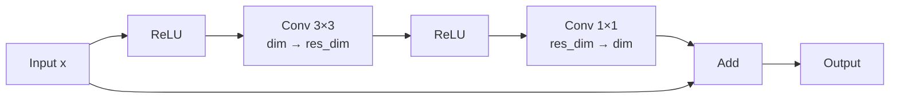

**Residual Layer Code**:
```python
class ResidualLayer(nn.Module):
    def __init__(self, in_dim, h_dim, res_h_dim):
        self.res_block = nn.Sequential(
            nn.ReLU(),
            nn.Conv2d(in_dim, res_h_dim, 3, 1, 1),  # Bottleneck
            nn.ReLU(),
            nn.Conv2d(res_h_dim, h_dim, 1, 1, 0)    # Expand
        )
    
    def forward(self, x):
        return x + self.res_block(x)  # Skip connection
```

**Benefits**:
- Gradient flow (skip connections)
- Increased model depth without degradation
- Feature refinement

### Parameter Count

**Typical Configuration** (ImageNet):
- `h_dim` = 128
- `res_h_dim` = 32
- `n_res_layers` = 2
- `embedding_dim` = 64
- `n_embeddings` = 512

**Approximate Parameters**:
- Encoder: ~500K
- Codebook: 512 × 64 = 32,768
- Decoder: ~500K
- **Total**: ~1M parameters

---

## Training Loop & Loss Computation

### Training Pipeline

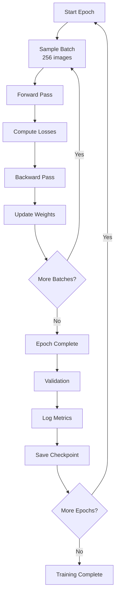

### Forward Pass Detail

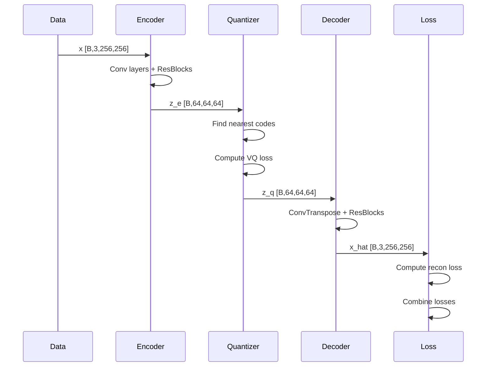

### Loss Function Components

The VQVAE training objective has **three components**:

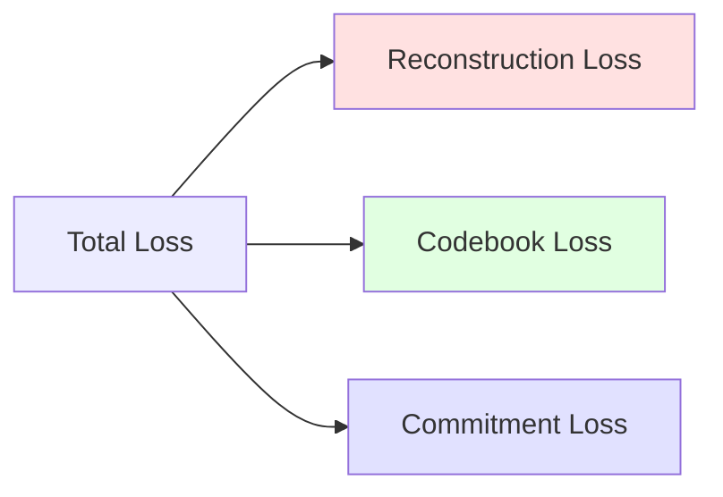

#### 1. Reconstruction Loss

**Purpose**: Make reconstruction close to original

```python
recon_loss = MSE(x, x_hat) / x_train_var
           = mean((x - x_hat)²) / x_train_var
```

**Normalization by variance**: Puts reconstruction error in units of "fraction of data variance"
- `x_train_var` ≈ 1.0 for normalized ImageNet
- Makes loss magnitude consistent across datasets

**Per-pixel detail**:
```
For each pixel (i,j) and channel c:
    error[i,j,c] = (x[i,j,c] - x_hat[i,j,c])²
    
recon_loss = mean(error) / x_train_var
```

#### 2. Codebook Loss (VQ Loss)

**Purpose**: Update codebook to match encoder outputs

```python
codebook_loss = mean(||sg[z_e] - e||²)
```

where:
- `z_e`: Encoder output (continuous)
- `e`: Quantized output (discrete from codebook)
- `sg[]`: Stop gradient operator

**Intuition**: Move codebook vectors toward the encoder outputs they're representing

**Gradient flow**: Only codebook embeddings are updated (encoder frozen via `sg[]`)

#### 3. Commitment Loss

**Purpose**: Encourage encoder outputs to commit to codebook entries

```python
commitment_loss = β · mean(||z_e - sg[e]||²)
```

where `β` = 0.25 (commitment cost)

**Intuition**: Prevent encoder from moving its outputs arbitrarily; make encoder "commit" to the codebook

**Gradient flow**: Only encoder is updated (codebook frozen via `sg[]`)

#### Combined Embedding Loss

```python
embedding_loss = codebook_loss + commitment_loss
               = mean(||sg[z_e] - e||²) + β·mean(||z_e - sg[e]||²)
```

This is returned by the VectorQuantizer and combined with reconstruction loss.

### Complete Loss Function

```python
# Main training loss
total_loss = recon_loss + embedding_loss

# With DGM (optional)
total_loss = recon_loss + embedding_loss + λ_dgm · dgm_loss
```

**Default hyperparameters**:
- `β` (commitment) = 0.25
- `λ_dgm` (DGM weight) = 0.01

### Loss Computation Code Flow

```python
# From main.py train() function
def train_step(x):
    # Forward pass
    embedding_loss, x_hat, perplexity = model(x)
    
    # Reconstruction loss
    recon_loss = torch.mean((x_hat - x)**2) / x_train_var
    
    # Combine losses
    loss = recon_loss + embedding_loss
    
    # Optional: Add DGM loss
    if use_dgm_loss:
        dgm_loss = compute_dgm_loss(x, x_hat, dgm_model)
        loss = loss + dgm_loss_weight * dgm_loss
    
    # Backward pass
    optimizer.zero_grad()
    loss.backward()
    optimizer.step()
    
    return loss, recon_loss, embedding_loss, perplexity
```

### Gradient Flow

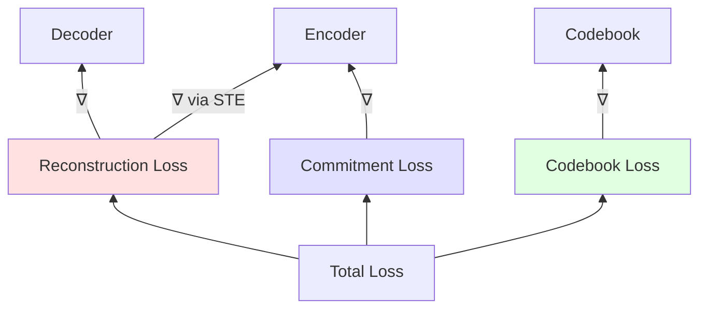

**Straight-Through Estimator (STE)**:
- Forward: `z_q` (discrete)
- Backward: Gradients flow to `z_e` (continuous)
- Implementation: `z_q = z_e + (z_q - z_e).detach()`

### Optimization

**Optimizer**: Adam
```python
optimizer = torch.optim.Adam(
    model.parameters(),
    lr=3e-4,
    amsgrad=True  # Improved convergence
)
```

**Learning Schedule**: Fixed learning rate (no decay)

**Training Steps**:
- ImageNet Val: 100,000 updates
- ImageNet Full: 200,000 updates

**Batch Size**: 256 images

**Effective Data Seen**:
- Val: 256 × 100,000 = 25.6M images (512× dataset)
- Full: 256 × 200,000 = 51.2M images (40× dataset)

---

## Deep Geometric Moments (DGM) Loss

### What is DGM Loss?

Deep Geometric Moments (DGM) is an auxiliary loss that preserves spatial structure and semantic content using features from a pretrained classifier.

**Key Idea**: Images with similar semantic content should have similar geometric moment representations in a pretrained feature space.

### DGM Architecture

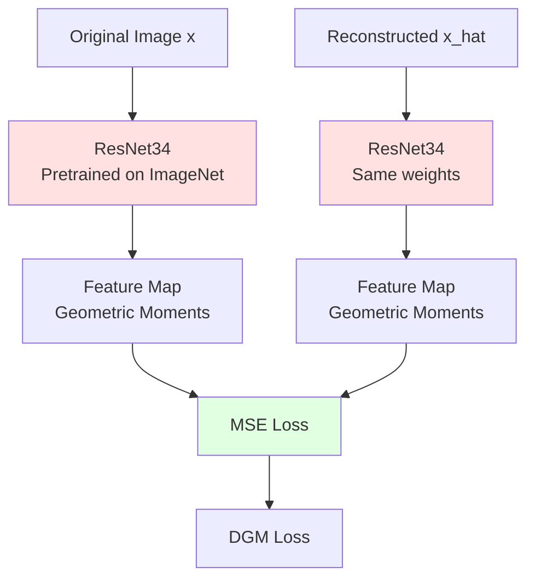

### How DGM Works

#### 1. Feature Extraction

**DGM Model**: ResNet34 pretrained on ImageNet
- Frozen weights (no gradient updates)
- Extracts features at multiple scales
- Computes geometric moments of feature maps

**Feature Processing**:
```python
# For ImageNet DGM model
def forward(x):
    # x: [B, 3, 256, 256]
    features = resnet34(x)  # Extract features
    # features: [B, 512, H, W]
    
    # Compute geometric moment representation
    moments = compute_geometric_moments(features)
    # moments: [B, D] - aggregated spatial statistics
    
    return moments
```

#### 2. Loss Computation

```python
def compute_dgm_loss(x, x_hat, dgm_model):
    # Resize to DGM resolution if needed
    if x.shape[-1] != dgm_size:
        x_resized = F.interpolate(x, size=(dgm_size, dgm_size))
        x_hat_resized = F.interpolate(x_hat, size=(dgm_size, dgm_size))
    
    # Extract features (no gradient for original)
    with torch.no_grad():
        _, moments_x = dgm_model(x_resized)
    
    # Extract features (with gradient for reconstruction)
    _, moments_x_hat = dgm_model(x_hat_resized)
    
    # Compute MSE between moment representations
    dgm_loss = torch.mean((moments_x - moments_x_hat) ** 2)
    
    return dgm_loss
```

#### 3. Loss Integration

```python
total_loss = recon_loss + embedding_loss + λ_dgm · dgm_loss
```

where `λ_dgm = 0.01` (DGM loss weight)

### Benefits of DGM Loss

1. **Semantic Preservation**: Encourages reconstructions to maintain semantic content
2. **Spatial Structure**: Preserves important spatial relationships
3. **Perceptual Quality**: Improves visual quality beyond pixel-level MSE
4. **Regularization**: Prevents overfitting to pixel noise

### DGM Model Specifications

**For ImageNet**:
- Architecture: ResNet34
- Pretrained on: ImageNet classification
- Input size: 256×256
- Checkpoint: `/scratch/sbeeredd/sandbox/Deep-Geometric-Moment/checkpoints/res34_model_best.pth.tar`

**For CIFAR**:
- Architecture: ResNet18
- Pretrained on: CIFAR10/100 classification
- Input size: 32×32

---

## Complete Training Pipeline

### End-to-End Training Flow

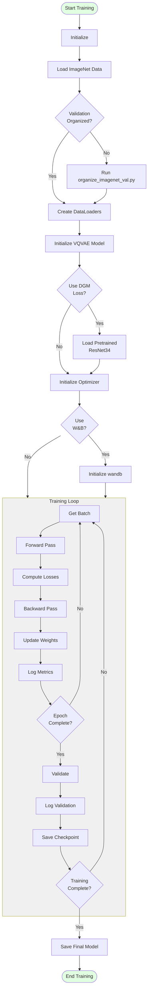

### Detailed Training Algorithm

```python
# Pseudocode for complete training
def train():
    # ===== INITIALIZATION =====
    # 1. Load data
    train_data, val_data, train_loader, val_loader, x_train_var = \
        load_data_and_data_loaders('IMAGENET_FULL', batch_size=256)
    
    # 2. Initialize model
    model = VQVAE(
        h_dim=128,
        res_h_dim=32,
        n_res_layers=2,
        n_embeddings=512,
        embedding_dim=64,
        beta=0.25
    ).to(device)
    
    # 3. Load DGM model (optional)
    if use_dgm_loss:
        dgm_model = load_dgm_model(
            dgm_model_path,
            num_classes=1000,
            model_type='imagenet',
            arch='resnet34'
        )
        dgm_model.eval()  # Frozen
    
    # 4. Initialize optimizer
    optimizer = torch.optim.Adam(model.parameters(), lr=3e-4)
    
    # 5. Initialize logging
    if use_wandb:
        wandb.init(project='vqvae-imagenet')
    
    # ===== TRAINING LOOP =====
    steps_per_epoch = len(train_loader)
    global_step = 0
    
    for update in range(n_updates):
        # Get batch
        x, _ = next(iter(train_loader))
        x = x.to(device)  # [B, 3, 256, 256]
        
        # Forward pass
        optimizer.zero_grad()
        embedding_loss, x_hat, perplexity = model(x)
        
        # Compute reconstruction loss
        recon_loss = torch.mean((x_hat - x)**2) / x_train_var
        
        # Total loss
        loss = recon_loss + embedding_loss
        
        # Add DGM loss (optional)
        if use_dgm_loss:
            dgm_loss = compute_dgm_loss(x, x_hat, dgm_model)
            loss = loss + dgm_loss_weight * dgm_loss
        
        # Backward pass
        loss.backward()
        optimizer.step()
        
        # Log training metrics
        if use_wandb:
            wandb.log({
                'train/recon_error': recon_loss.item(),
                'train/embedding_loss': embedding_loss.item(),
                'train/total_loss': loss.item(),
                'train/perplexity': perplexity.item(),
                'train/dgm_loss': dgm_loss.item() if use_dgm_loss else 0,
                'train/epoch': update / steps_per_epoch
            }, step=global_step)
        
        global_step += 1
        
        # Print progress
        if update % log_interval == 0:
            print(f'Update {update}, Loss: {loss.item():.4f}, '
                  f'Recon: {recon_loss.item():.4f}, '
                  f'Perplexity: {perplexity.item():.2f}')
        
        # Validation (every epoch)
        if update > 0 and update % steps_per_epoch == 0:
            validate(model, val_loader, x_train_var, dgm_model)
        
        # Save checkpoint
        if save and update % log_interval == 0:
            save_checkpoint(model, optimizer, update)
    
    # ===== FINISH =====
    save_final_model(model)
    if use_wandb:
        wandb.finish()


def validate(model, val_loader, x_train_var, dgm_model):
    model.eval()
    val_losses = []
    
    with torch.no_grad():
        for batch_idx, (x_val, _) in enumerate(val_loader):
            if batch_idx >= 10:  # Limit validation batches
                break
            
            x_val = x_val.to(device)
            embedding_loss, x_val_recon, perplexity = model(x_val)
            recon_loss = torch.mean((x_val_recon - x_val)**2) / x_train_var
            
            val_losses.append({
                'recon': recon_loss.item(),
                'embedding': embedding_loss.item(),
                'perplexity': perplexity.item()
            })
        
        # Visualize reconstructions
        input_grid = make_grid(x_val[:8])
        recon_grid = make_grid(x_val_recon[:8])
        
        # Log to wandb
        wandb.log({
            'val/recon_error': np.mean([l['recon'] for l in val_losses]),
            'val/perplexity': np.mean([l['perplexity'] for l in val_losses]),
            'val/inputs': wandb.Image(input_grid),
            'val/reconstructions': wandb.Image(recon_grid)
        })
    
    model.train()
```

### Training Metrics

**Logged Every Step**:
- `train/recon_error`: Reconstruction MSE
- `train/embedding_loss`: VQ + commitment loss
- `train/total_loss`: Combined loss
- `train/perplexity`: Codebook usage
- `train/dgm_loss`: DGM auxiliary loss (if enabled)
- `train/epoch`: Current epoch (fractional)

**Logged Every Epoch**:
- `val/recon_error`: Validation reconstruction error
- `val/perplexity`: Validation codebook usage
- `val/inputs`: Sample input images
- `val/reconstructions`: Sample reconstructions

### Typical Training Curves

**Expected Behavior**:

1. **Reconstruction Loss**: Decreases from ~1.0 to ~0.01-0.05
2. **Perplexity**: Increases from ~1-10 to ~100-300 (out of 512)
3. **Embedding Loss**: Fluctuates around 0.01-0.1
4. **DGM Loss**: Decreases from ~0.1 to ~0.01-0.05

**Warning Signs**:
- **Codebook Collapse**: Perplexity < 10 (only few codes used)
- **Poor Reconstruction**: Loss not decreasing after 10K steps
- **Overfitting**: Train loss much lower than val loss

---

## Mathematical Foundations

### VQVAE Objective Function

**Complete objective**:
```
L = L_recon + L_vq + β·L_commit [+ λ·L_dgm]

where:
L_recon = 𝔼[||x - D(Q(E(x)))||²]
L_vq = ||sg[E(x)] - e||²
L_commit = ||E(x) - sg[e]||²
L_dgm = ||M(x) - M(D(Q(E(x))))||²  (optional)
```

**Notation**:
- `E(x)`: Encoder output
- `Q(·)`: Quantization (nearest neighbor)
- `D(·)`: Decoder
- `sg[·]`: Stop gradient
- `e`: Selected codebook vector
- `M(·)`: DGM moment extraction
- `β`: Commitment cost (0.25)
- `λ`: DGM weight (0.01)

### Vector Quantization Mathematics

**Distance computation**:
```
d(z, e) = ||z - e||²
        = ||z||² + ||e||² - 2⟨z, e⟩

For all embeddings:
D = ||Z||² ⊗ 1ᵀ + 1 ⊗ ||E||² - 2ZEᵀ
```

where:
- `Z`: [N, d] encoder outputs
- `E`: [K, d] codebook embeddings
- `D`: [N, K] distance matrix
- `⊗`: Outer product

**Quantization**:
```
k* = argmin_k d(z, e_k)
z_q = e_k*
```

**Straight-through gradient**:
```
Forward:  z_q
Backward: ∂L/∂z_e = ∂L/∂z_q
```

### Codebook Learning

**Exponential Moving Average (EMA) Update** (alternative to gradient):
```
N_k^(t) = γ·N_k^(t-1) + (1-γ)·n_k^(t)
m_k^(t) = γ·m_k^(t-1) + (1-γ)·Σ z_i

e_k^(t) = m_k^(t) / N_k^(t)
```

where:
- `N_k`: Count of assignments to code k
- `m_k`: Sum of encoder outputs assigned to code k
- `γ`: Decay rate (0.99)

**Note**: Current implementation uses gradient-based update via `L_vq`

### Perplexity Calculation

```
Perplexity = exp(H)
H = -Σ p_k log(p_k)

where:
p_k = (1/N) Σ_i 𝟙[argmin_j d(z_i, e_j) = k]
```

**Interpretation**:
- Perplexity = effective number of codes used
- Max perplexity = K (all codes equally used)
- Min perplexity = 1 (only one code used - collapse!)

---

## Implementation Details

### Memory Requirements

**Model Parameters**: ~1M
**Activation Memory** (batch_size=256):
- Input: 256 × 3 × 256 × 256 × 4 bytes = 192 MB
- Encoder output: 256 × 128 × 64 × 64 × 4 bytes = 128 MB
- Quantized: 256 × 64 × 64 × 64 × 4 bytes = 64 MB
- Decoder output: 256 × 3 × 256 × 256 × 4 bytes = 192 MB
- **Total**: ~600 MB per batch

**Codebook**: 512 × 64 × 4 bytes = 128 KB (negligible)

**Recommended GPU**: 16GB+ VRAM for batch_size=256

### Computational Complexity

**Encoder**: O(H × W × C × D)
- Input: H×W×C (256×256×3)
- Operations: ~10 conv layers
- Output: h×w×D (64×64×128)

**Quantization**: O(N × K × d)
- N = batch_size × h × w (256 × 64 × 64)
- K = codebook size (512)
- d = embedding dim (64)
- **Dominant operation**: Distance matrix computation

**Decoder**: O(h × w × D × C)
- Similar to encoder (reversed)

**DGM**: O(ResNet34 forward pass)
- Additional ~100 ms per batch

### Training Time Estimates

**ImageNet Val (50K images, 100K updates)**:
- Steps per epoch: 50,000 / 256 ≈ 195
- Total epochs: 100,000 / 195 ≈ 512
- Time per step: ~0.5s (with DGM: ~0.6s)
- **Total time**: ~14-17 hours on single V100

**ImageNet Full (1.28M images, 200K updates)**:
- Steps per epoch: 1,280,000 / 256 = 5,000
- Total epochs: 200,000 / 5,000 = 40
- Time per step: ~0.5s (with DGM: ~0.6s)
- **Total time**: ~28-34 hours on single V100

### Checkpointing

**Saved every `log_interval` steps** (default: 100):

```python
checkpoint = {
    'model': model.state_dict(),
    'results': {
        'recon_errors': [...],
        'loss_vals': [...],
        'perplexities': [...],
        'dgm_losses': [...],
        'n_updates': current_update
    },
    'hyperparameters': {
        'batch_size': 256,
        'learning_rate': 3e-4,
        'n_embeddings': 512,
        ...
    }
}
torch.save(checkpoint, f'results/vqvae_data_{filename}.pth')
```

### Reproducibility

**Random Seeds**:
```python
torch.manual_seed(42)
np.random.seed(42)
random.seed(42)
if torch.cuda.is_available():
    torch.cuda.manual_seed_all(42)
```

**Deterministic Operations**:
```python
torch.backends.cudnn.deterministic = True
torch.backends.cudnn.benchmark = False
```

**Note**: DataLoader shuffling introduces randomness

---

## Summary

### Key Takeaways

1. **Dataset Processing**:
   - Extract ImageNet to organized structure
   - Run `organize_imagenet_val.py` to organize validation set
   - Use PyTorch ImageFolder for automatic class labeling

2. **Data Pipeline**:
   - Resize to 256×256, normalize to [-1, 1]
   - Batch size 256 for efficiency
   - Data augmentation (RandomHorizontalFlip) on training set

3. **Model Architecture**:
   - Encoder: 3×256×256 → 128×64×64 (compression)
   - Quantizer: Continuous → Discrete (512 codes, 64-dim)
   - Decoder: 64×64×64 → 3×256×256 (reconstruction)
   - Total: 16× spatial compression

4. **Loss Components**:
   - Reconstruction: MSE between input and output
   - Codebook: Update embeddings toward encoder outputs
   - Commitment: Encourage encoder to commit to codebook
   - DGM (optional): Preserve semantic structure

5. **Training**:
   - Adam optimizer, lr=3e-4
   - 100K updates (val) or 200K updates (full)
   - Monitor: loss, perplexity, reconstructions
   - ~14-34 hours on single V100 GPU

### Running Training

**Quick Start**:
```bash
# 1. Organize dataset (one-time)
cd /scratch/sbeeredd/sandbox/vqvae
python organize_imagenet_val.py

# 2. Train baseline
bash train_imagenet_val.sh

# 3. Train with DGM
bash train_imagenet_val_dgm.sh
```

**Monitor Progress**:
- Weights & Biases dashboard
- Console output every 100 steps
- Validation images every epoch

**Expected Results**:
- Reconstruction loss: ~0.01-0.05
- Perplexity: ~100-300 (out of 512)
- Visual quality: Sharp, detailed reconstructions

---

## References

1. **VQVAE Paper**: [Neural Discrete Representation Learning](https://arxiv.org/abs/1711.00937)
2. **ImageNet**: [ImageNet Large Scale Visual Recognition Challenge](https://arxiv.org/abs/1409.0575)
3. **Deep Geometric Moments**: Custom implementation for perceptual loss
4. **ResNet**: [Deep Residual Learning for Image Recognition](https://arxiv.org/abs/1512.03385)

---

**Document Version**: 1.0  
**Last Updated**: November 27, 2025  
**Author**: VQVAE Training Documentation
